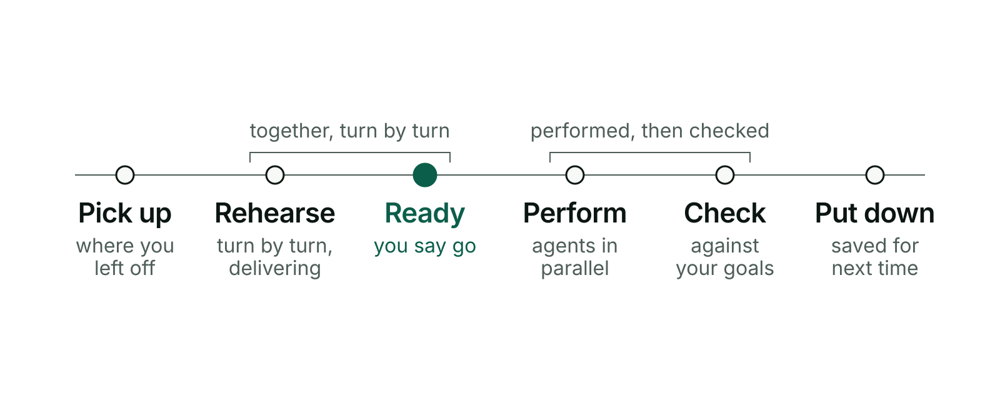
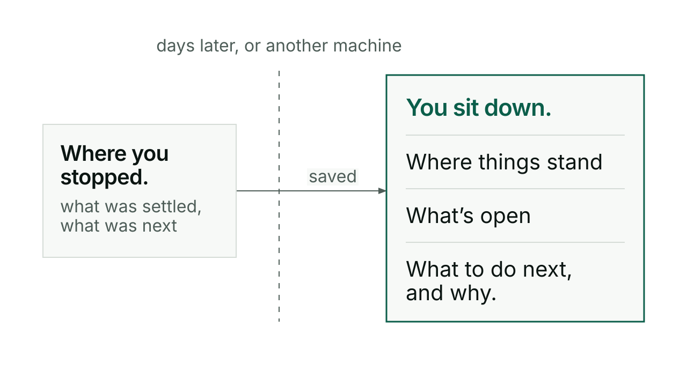
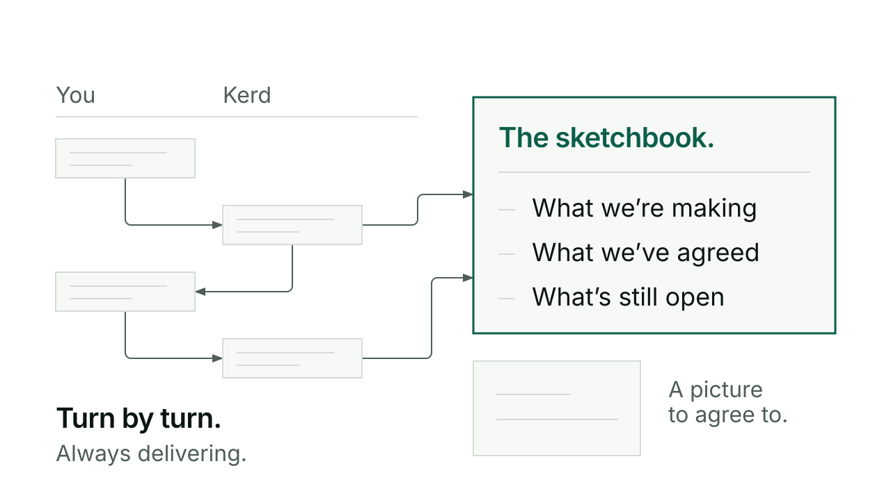
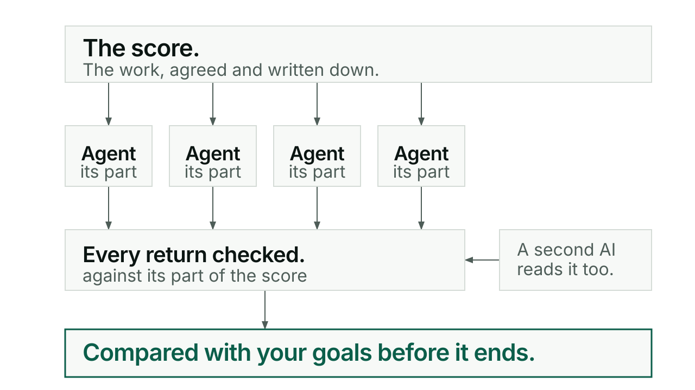

# Kerd

Kerd turns working with an AI from a string of chats into a piece of work. You
rehearse the work together until you both know what done means. Then Kerd writes
the score, and a team of agents performs it — with your goals checked before it
ends.

**Rehearsal, then the concert.** Two words carry the whole of Kerd. *Rehearsal*
is the part you are in: working it through turn by turn, in any order, shipping
as you go, while Kerd keeps a sketchbook of what is settled. *The concert* is
what happens once you say you are ready: the work is written down as a score,
and a team of agents performs it — no turn-by-turn questions, because the asking
already happened. It comes back to you only if something the score cannot answer
turns up. You decide when rehearsal ends, and nothing is performed that
you have not agreed.

**Who it is for:** people already working in Claude Code or Codex, in a project
folder tracked by Git. If that is not you yet, set those up first; Kerd does not
replace them. **How new it is:** picking work up and putting it down has been in
daily use for months. Rehearsal and the concert shipped in 0.139.0, and the
README, guides and [live site](https://kerd-six.vercel.app/) are their first real use.



**Kerd runs inside Claude Code, and a four-skill core can be built for Codex.** It
is a plugin: a set of skills you call by name, plus the records they keep on disk so
the next sitting, meaning one stretch of work from opening the project to putting it
down, can read them.

The work is whatever those two tools can do inside a project folder: code, a set
of documents, a research write-up, a website. This README, the guides, the
pictures and the site in this repo were made with Kerd in one piece of work, and
most of it is prose and drawings rather than code. What you need is one of the two
tools, a project folder tracked by Git, because Kerd keeps its records as files in
that folder and saves them with Git, and ordinary language. Kerd adds no server,
no inbox and no service of its own.

## Why you would care: three things that go wrong today

### You lose your place

Every new chat starts from nothing, and you re-explain. With Kerd you sit down
and it tells you where things stand, what is open, and the one thing it would do
next and why. On this machine or another.



Guide: [Switch](docs/guide/switch.md).

### What you want never gets pinned down

The AI starts building before either of you knows what "done" means. With Kerd
you rehearse: work it through turn by turn, still delivering as you go, while
Kerd keeps a sketchbook, a running note of what is settled, one per piece of
work, and draws pictures you can agree to. Ask "where are we?" at any point and
it answers from that sketchbook.



Guides: [Conductor](docs/guide/conductor.md), [Visuals](docs/guide/visuals.md).

### It's done when your spec and goals are met

Today everything stays turn by turn, and done is whatever the AI says it is. With
Kerd, once you are ready, the work is written as a score, the plan with one step per
part, and performed as a concert: many players, each an agent given one step and
running alongside the others, every return checked, the result compared with your
goals before it ends. A gap the score cannot answer stops that part and comes
back to you in the chat for that one point, not to the start. A second AI can
read the work too: another Claude or Codex session, either a partner you have
already paired with, which knows the project, or a fresh reviewer started for that
one job and given the brief and the sources, not the builder's account of what it
did.



Guides: [Conductor](docs/guide/conductor.md), [Agent](docs/guide/agent.md).

As said at the top, this part is new. Everything below is marked for what it is:
where a claim has been proved by running it, this page says so, and where it has
not, it says that too.

## Install

```
claude plugin marketplace add anthonymaley/Kerd
claude plugin install kerd@kerd-marketplace
```

**In Codex, Kerd takes a different route:** a core of four skills that you build
from a source checkout. See
[getting started](docs/guide/getting-started.md#install-in-codex).

**Try a version before adopting it**, without installing it:

```
claude --plugin-dir /absolute/path/to/kerd
```

The local copy loads alongside whatever you already have, as a session-only
plugin: `claude plugin list` shows both, the installed one still enabled and the
local one loaded beside it. Closing the session ends that. Nothing is installed
and nothing is disabled, but it is not trace-free: starting a session this way
records one line of usage in your `~/.claude.json`. Tested in a throwaway
profile on 2026-09-20. Which copy's skill text a running session prefers has not
been tested.

## Your first five minutes

Open the project folder you want to work in and say:

```
/kerd:switch in
```

Kerd reads the project and tells you where things stand in plain English. This is
the real arrival from the sitting that made this package, on 2026-09-18, cut down
to fit here:

> **KERD · SWITCH IN COMPLETE ✓**
>
> | PROJECT | PHASE | NEXT | TEAM |
> | --- | --- | --- | --- |
> | Kerd | released, not yet seen in use | Rehearse one real piece of work with 0.139.0. | Claude (build and release; arrival and closeout checks) + Codex (expert review and investigation) |
>
> **Where things stand:** Kerd 0.139.0 is out: Conductor now works as rehearsal
> … and then a concert performed by fanned-out players and checked against the
> agreed goals. It is wording only and nobody has used it on real work yet.
>
> **Open work**
>
> 1. Rehearse one real piece of work with 0.139.0 and record what Conductor
>    actually does … [the owner] picks the work and the project.
> 2. Watch the arrival and closing screens over several sittings …
>
> **Recommended:** Rehearse one real piece of work with 0.139.0.
>
> **Why:** … It is wording a model may or may not follow, and it has no test, so
> only a real sitting shows which.
>
> > 💬 **Start a Conductor session?**

Say yes to the work it recommends, or name something else. Then work. Talk it
through, change your mind, ship as you go. When you stop:

```
/kerd:switch out
```

That saves the place: what changed, what got settled, what comes next and why.
The following sitting starts from it, here or on another machine.

Step by step, including what each question means and what to do when something is
missing: [getting started](docs/guide/getting-started.md).

## What Kerd lets you do

| You can | The skill | Guide |
|---|---|---|
| Put work down and pick it up exactly where you left it | Switch | [switch](docs/guide/switch.md) |
| Shape a piece of work, agree it, and have it performed | Conductor | [conductor](docs/guide/conductor.md) |
| See it: pictures of what you are making, as you go | Visuals | [visuals](docs/guide/visuals.md) |
| Get a second opinion from another AI session, Claude or Codex | Agent | [agent](docs/guide/agent.md) |
| Keep the project tidy and catch what has drifted | Tend, Slainte | [tend and slainte](docs/guide/tend-and-slainte.md) |
| Keep what you learn, and write like a person | Kivna, Skriv | [kivna and skriv](docs/guide/kivna-and-skriv.md) |

Every command, one line each: [reference](docs/guide/reference.md).

Kerd also runs a small release rules check in CI, the checks GitHub runs on a
push: it catches version drift and a mismatched capability list between the
plugin manifests on every push. What keeps the work itself honest is
the sketchbook that becomes a spec, the score the build is checked against, the
goal check at the end, and an independent reviewer, not a machine that refuses
your work.

## What it writes, and how to remove it

Four kinds of file carry the work, and all four are ordinary Markdown: open
them, read them, edit them, commit them.

| File | What it holds |
|---|---|
| `CONTEXT.md` | what is currently true about the project, overwritten each time, never a diary |
| `TODO.md` | open work only: `## Now` and `## Backlog`, one line each |
| `kivna/sessions/YYYY-MM-DD.md` | one log per day: what was done, key decisions, commits, what is next |
| `docs/work/<name>/work.md` | one record per piece of work: the direction, what is settled, what is still open |

Those four are not everything Kerd writes. Drawings are saved as HTML and SVG
beside the work record. If you opt into the Obsidian vault, `kivna/vault.json`
is committed JSON and the vault itself lives outside your project. And some
working state is meant to stay out of Git, under `.agents/` and parts of
`kivna/`, so it belongs in your `.gitignore`.

Switch Out saves them with Git, and it commits the files it names and nothing
else. It pushes when you have given it the authority to push; a
local-only save is a valid choice and needs no push permission or GitHub access.

To remove Kerd:

```
claude plugin uninstall kerd@kerd-marketplace
```

The four files stay in your project. They were readable without Kerd the whole
time.

## What it costs

Rehearsal is an ordinary conversation: one session, one model, the cost of a
chat. A concert is not. It runs several players at the same time, each its own
agent, and then a second AI reads the result, so a concert spends more than the
same work done in one chat. Nobody has measured how much more, and this page is
not going to guess at a number.

## Examples

Real work, not invented.

- [MusicTUI across sittings](examples/musictui-across-sittings.md). A terminal app carried through many sittings, the place saved and picked up each time.
- [A reviewed release](examples/a-reviewed-release.md). A Kerd release read by an independent second AI before it shipped.
- [This package](examples/this-package.md). The README, site and guides you are reading now, from rehearsal to concert.

## Rolling back

**Rollback is a Git reference, never a cached plugin file.** Claude Code garbage-
collects old versions out of `~/.claude/plugins/cache/`, so a version you can see
there today may be gone tomorrow — that is what silently killed hooks across eleven
repos before v0.96.0. Roll back by pinning the marketplace to a tagged commit:

| Want | Reference |
|---|---|
| The last commit before Conductor/Switch were replaced | `716a099` on `origin/main` |
| Undo the release, keep the history | `git revert <release commit>` |

**Read this before pinning to an old commit.** From `bc0d78e` on 2026-02-27
until the fix in 0.142.1 on 2026-09-20, this project's marketplace manifest
named itself by its SSH address, and `claude plugin install` clones that address
literally. `716a099` is inside that range. Pinned anywhere in it, the install
fails with `Permission denied (publickey)` for anyone who has not set up a
GitHub key, and no environment variable changes that: the address is explicit,
so there is no shorthand for the CLI to re-resolve. Tested in a throwaway
profile on 2026-09-20.

Two ways round it, neither run against an old commit: take a checkout of the
version you want and point `--plugin-dir` at it — loading a local checkout that
way was observed working on 2026-09-20, with a current one — or edit the `url`
in that commit's `.claude-plugin/marketplace.json` to the `https://` form before
installing, which is the operation the 0.142.1 fix itself was proved with on
2026-09-19, against a fixed manifest rather than an old one.

This repo carries **no tags** — `git tag` returns nothing — so a commit SHA is the
only durable reference today. If you want `v0.107.0` to be tag-addressable, the tag
has to be created and pushed as part of publishing; until then, cite the SHA.
Confirm what a reference points at with `git show --stat <ref>` before relying on it.

## Naming

Gaelic-inspired where it adds character:
- **Kerd**: skill (ceird)
- **Kivna**: memory (cuimhne)
- **Conductor**: keeps one session in tempo (renamed from *dian*, Gaelic for intense/rigorous)
- **Skriv**: the act of writing (scríobh)
- **Switch**: session handoff
- **Slainte**: health (slàinte)
- **Tend**: from English "to tend" (care for, maintain)

## What's New (v0.152.0)

Every release, newest first. The same history is kept in [CHANGELOG.md](CHANGELOG.md).

### v0.152.0

**Conductor's Opus 5.5 guidance, checked against Anthropic's guide.** Kerd now
recommends Opus 5.5 for the session that conducts, at medium effort by default, and
never changes that session itself. The Opus 5.5 profile gets a new dated version, with
the old one archived. Two clauses now match the provider's wording: trying other effort
levels is encouraged, and visual scaffolding is re-tested rather than dropped. The
max_tokens advice is marked as API-only, since Claude Code agents don't set it. Three
pending clauses come from the same guide: handling a premature stop in an unattended
run, a time budget for fan-out, and exploring before acting on a loose brief. Two
clauses carry a first observation each, one paired run: medium and high both found all
five planted bugs in a review, and a generic "avoid an AI look" frontend brief produced
four of the five patterns the guide names.

### v0.151.1

**Tend and Slainte describe the plugin-root placeholder instead of spelling it out.**
Claude Code replaces that placeholder with the install path when it loads a plugin skill,
and nothing keeps it literal, so where Tend's stale-hook check and Slainte's hook check
meant the unexpanded text, the model read an install path instead. The four lines now
describe the form they look for, and a test keeps those two skills from spelling it out
again. The substitution was observed; Tend actually missing a stale entry was not. Tend
and Slainte are not in the Codex package, so Codex is unaffected.

### v0.151.0

**Codex builds only when you say so.** Conductor now builds with its own host's workers
and the other provider reviews, and a Codex builder
under a Claude conductor (or the reverse) is an exception you ask for or approve, with a
reason such as stalled work, evidence of a better fit, or spare capacity on the other
provider. Without a comparison behind it, the Fit line calls it a trial. The guide also
separates what a provider suggests, what worked here before and what a real comparison
showed, since only the last supports preferring one model, and it judges a result by the
agreed outcome first, then rework, intervention, time and usage.

### v0.150.0

**The arrival names the Kerd version that drew it.** A Switch In screen said where the
work stood but not which Kerd produced it, so the only way to know was to find the
version in a file path the session happened to read, as in Codex's pickup of Seinn on
2026-09-23, or to trust a version remembered from a record, which went wrong on
2026-09-13. The heading now reads, for example, "SEINN · SWITCH IN COMPLETE ✓ · Kerd
0.150.0". The renderer reads it from the installed package's own manifest, in Claude
Code and in Codex alike, and says "Kerd version not read" rather than guessing when it
cannot.

### v0.149.2

**The getting-started walkthrough says what to type in Codex.** A fresh Codex session
picked up a real project well on 2026-09-23, but only after the first two tries,
`/switch` and `/kerd`, were rejected: the walkthrough gave Claude Code's slash commands
and nothing else. Each step now says what a Codex user types instead ("Switch in.",
"Switch out."), how to check the install there, and that setting a project up with Tend
needs Claude Code, since Tend is not in the Codex package. Guide wording only; no skill
changed.

### v0.149.1

**The getting-started guide catches up with the concert.** The first page a new user
reads described the concert without saying it runs on a branch of its own, so someone
finishing their first concert would find their work missing from `main` and be asked
for a merge the page never mentioned. It now says so: the concert performs on
`concert/<work>`, and nothing reaches `main` without your go. The same page also named
0.139.0 as the current release; that sentence now names no current version, so it
cannot go stale again. Guide wording only; no skill changed.

### v0.149.0

**A review your partner doesn't answer gets a fresh reader, not a waiver.** When the Codex
partner a project reviews with was closed, Kerd explained that, would not swap in
another reviewer without asking, and then recommended pushing without the review as low
risk. On 3of3, three pushes went out that way, and the partner found a defect already
running on both televisions when it came back. Now, after ten minutes with no answer,
Kerd says so and recommends a fresh one-off reviewer, read only, which starts only on
your yes; the push waits for it. Your partner's request stays queued and its findings
still count. Skipping the review is still your call, and Kerd no longer recommends it.
Wording only; not yet seen in a real sitting.

### v0.148.0

**Kerd's model guide now knows the current models.** The guide Conductor uses to choose and
brief a model was last checked on 8 September. Since then Anthropic made Claude Opus 5.5
its default starting point, with a medium default effort and thinking that cannot be
turned off, and moved Opus 5 to its legacy list; OpenAI's newest line is GPT-6 Astra,
Sol and Luna, with no Terra tier. The shortlist is rechecked against both
providers' pages as of 23 September, with new briefing profiles for Opus 5.5 and GPT-6
written from their official guides. Opus 5 and GPT-5.6 keep their profiles for runs that
ask for them. GPT-5.6 has left the API catalogue's general-model list, while Codex
says it stays available during the rollout. Nothing has run on the new profiles yet, so every clause in them is untested.

### v0.147.0

**The running-job list now names the model as well as the effort, where the model has one.** Claude Code's list of
running jobs shows each job's agent name beside a live activity line, and Kerd's agents
were named for the effort alone, so every row read `kerd:effort-high` whatever model it
ran on. The description Kerd sends with each job never appears there, so writing the model
into it would not have helped. Kerd now ships agents named for both, `kerd:sonnet-low` to `kerd:fable-max`, and
each sets the model and effort its name carries; Haiku takes no effort setting, so its
agent is plain `kerd:haiku`.
Conductor and Agent pick the one that matches the call's model, and the call still names
that model. The five `kerd:effort-<level>` agents stay for sessions that started before
this release. `/tasks` also shows each job's model, and its effort where the model supports one. The finding comes from one session
with four jobs; the new names have not yet been seen in the list.

### v0.146.0

**Kerd keeps going, or says what it is waiting for.** A turn could end in a third way
besides working and asking: idle, with nothing asked, because the steps ran out or a
document ended. Coming back to a session like that, you have to ask what is going on. A
turn now ends carrying on — the goal is clear and the authority already covers the next
step, so it takes it — or stopped on one question you can answer cold, saying what is
blocked, what it is waiting for and what follows each answer. This holds in rehearsal as
much as in the concert: research, drafts, checks and the score are worked through without
pausing between them for permission to continue. Reported after it cost time across two
projects in one day.

### v0.145.1

**The picture-by-path route now has evidence on both providers.** 0.143.0 taught Kerd to
show a partner an image by naming its path, but that had only been seen on a Codex
session. A Claude session was given one absolute path and answered three questions whose
answers exist only in the picture: correct on all three. Documentation only, and the
remaining gaps are named where the route is described — on Claude it has been seen with a
fresh worker, not an established partner, and not yet with a file outside the project.

### v0.145.0

**A report that takes something back says so first, and a finish says what comes next.**
Two things Kerd's report shape got wrong, both seen repeatedly in real sittings. A message
that had to deliver a result *and* retract an earlier claim was over its five-item budget
before it started, so the retraction drifted to the end or went missing; a correction of
your own earlier claim now travels in the opening lines beside the result and never
competes for those five places. And the finish rule let a report end on "no action needed"
while open work was waiting, so the sitting stalled until the person asked what was next;
a finish now names the next item and its reason, then either carries on where the
authority already covers it or ends on the one question that starts it.

### v0.144.1

**The pictures stay readable on a laptop.** Kerd's own rule is that a label never renders
below 13px at the width it is read, and the site broke it: beside its text a picture is half
the page, so on a 13-inch window its smallest labels fell to 12.6px, and one label in the
concert picture was under the floor even on a large screen. The site now stacks below
1200px, giving each picture the full width and its labels 26px, and the concert picture's
smallest type went up a step. Also corrects three records: the state contract described the
`.active-modes` file as shared mode state when Skriv is now its only writer, the Kivna
export list named it as an export, and the machine-setup check looked for a pairing file
that went with the retired Pair skill, and the playbook still described the retired
conductor marker as live.

### v0.144.0

**A long build no longer publishes half-built work when it moves to a fresh session.**
A concert, Conductor's build to an agreed score, rolls to a fresh session between batches
when its context runs low, and that roll is a Switch Out, which commits and pushes. So the
first half of a build could land on `main` before the second half existed. A concert now
performs on its own branch, `concert/<work>`, started at the go you already give it. Every
save and roll lands there, and after the goal check Conductor asks you one thing: merge
it back. Nothing reaches `main` without your go. Rehearsal and small work stay where they
are. Switch needed no new machinery: its save already works on whichever branch is
checked out. Not yet seen in a real concert.

### v0.143.0

**Your partner can see what you are looking at.** Asked to show some mockups to a Codex
partner, Kerd had no way to do it, so Claude sent them to a brand-new Codex that knew
nothing about the project, and said so. The partner never saw them. Codex's message route
refuses image attachments outright, but a partner told where the file is opens it with its
own viewer: tested on a file in its own folder and on one elsewhere on disk, and it read
both back correctly. Agent now sends the path. A fresh Codex that takes the picture
directly is still there, but only when you ask for one. Reported by a Kerd user. Not yet
tried with a Claude partner.

### v0.142.1

**Anyone can install it.** The address Kerd published for itself reached the project over
SSH only, so anyone who has not set up a GitHub key on their machine was refused. Adding
the marketplace worked for everybody, because that step checks whether you have a key and
takes the open route when you do not. Installing never checked. It used the published
address exactly as written, was refused, and left nothing behind: no plugin, and none of
the eight skills. The address is now the ordinary public link to the project, tested on a
machine with no key and on one with a key, both installing all eight skills. No skill
behaviour changed. It was found by running the published commands from scratch for the
first time.

### v0.142.0

**One way to keep work honest.** Kerd carried two: the sketchbook, score and goal check
that people use, and a ladder of machine checks with a tiered risk ledger that nobody
did. The second is retired. Gone are the check tools and the ladder, Conductor's step
check (added in 0.137.0), the requirements register tools, the design matrix, the
progress board, the old diagram generators, the handoff fidelity check, and the
"Checks that can say no" guide with its picture. In their place Conductor keeps a short
list of risks in view: when you or the work names something that could sink it or hurt
later, it goes in the sketchbook in one plain sentence with what is being done about it,
and Conductor reads the list back before it says Ready and before the goal check. No
sizing, no columns, and it never invents a risk to fill the list. The release rules
check that protects every push (version numbers in step, the two capability lists
identical, slash commands carrying the `kerd:` prefix) now lives in its own small file,
`tools/release_check.py`, and CI runs three steps: skill tests, hook tests and that
check. The old work items, gate records, plans and designs stay where they were, as
history that nothing polices. The risks rule is wording and a wording test; not yet
seen in real use.

### v0.141.0

**Kerd installs what its front page describes.** The plugin shipped twelve skills while
the README, the website and the guides described eight. Drive, Lorg, Interrogate and Pair
are removed, and `/kerd:drive`, `/kerd:lorg`, `/kerd:interrogate` and `/kerd:pair` no
longer exist. That is a breaking change for anyone who used them. Conductor already does
Drive's job of carrying a piece of work across sittings, and its rehearsal covers whether
the work can succeed and is worth doing, which is what Interrogate asked. Pair's session hook goes
with it: no line is added to your prompts, and a `kivna/.pair` file left in a project
is now inert and safe to delete. The eight that remain are Switch, Conductor, Visuals,
Agent, Tend, Slainte, Kivna and Skriv. The checks, the ladder and the risk-ledger format
are unchanged in this release.

### v0.140.0

**Reports you can read at a glance.** Every time Conductor reports work, a job
returning, a batch finishing, a review coming back or the finish, the message now has
one shape: the first line says what you have now and where to look at it, the second
says where the work stands, at most five items are on screen with the rest kept in the
sketchbook behind a link, a side issue gets one line at the end, and before sending
Conductor checks that the first and last lines alone tell you what happened and what
to do next. The grid and the evidence still appear, after those two lines. The shape
never hides a limit or a failed check. It comes from the first real concert, where the
owner's verdict on the reports was "thats a lot of text" and "seems chaos", and five of
its rules are adapted from ayghri's i-have-adhd skill (MIT). Wording and a wording
test; not yet seen in real use. The delegation grid also drops its routing column: it now says who does each job in plain words (an agent, your Codex partner, this session) beside the model and the effort, because a label like `kerd:effort-high` means nothing to the person reading it and the effort column already says it. The call still carries the model and the effort label.

### v0.139.0

**Rehearsal, then the concert.** Conductor now names the two ways work happens.
Rehearsal is what you already do: turn by turn, in any order, shipping as you go,
with no gates or sequence. Along the way Conductor keeps a **sketchbook** for the
work (the idea and why, whether it is worth doing, goals, constraints, design) and
answers "where are we?" from it. The score is written as you go, and the composer
can be called at any time. **Ready** can come from you or from Conductor ("I think
we're ready", or "we need this first"). The **concert** is implementation to the
score: as many agents as the score allows, each with its own part, context windows
rolling, and the result compared with your goals before the loop ends. Agents and
pictures work the same in both. Switch Out adds anything a sitting settled to the
sketchbook without asking you anything, and Switch In says what is settled and
what is still open for each piece of work. Not yet seen in real use.

### v0.138.1

**The Switch Out grid says what was released, not the next step twice.** The
grid's NEXT cell repeated the "Next time" line below it. It now shows what this
sitting released ("0.136.0 → 0.138.0", or "Nothing released"); the next step
appears once, with its reason.

### v0.138.0

**The Switch Out screen matches Switch In.** The closing box used to list the
save's plumbing (commit, file count, remote, tree state, a memory flag, a
byte-and-token count, a reading list, a log path, a render time) and never said
what the session achieved. Now it opens with the same kind of grid as the
arrival (project, how far the save got, phase and next step), lists what
changed this session in product terms, gives the next step with its reason,
and ends on one line: *Exit and restart or /clear and /kerd:switch in to pick up
from here.* The save details stay in the records the next Switch In reads. A
save that did not reach the remote, memory that is not ready or work left behind
still shows, under Attention, whenever it is true, and the restart line appears
only after a confirmed save.

### v0.137.1

**The step check is tested in both directions.** 0.137.0 proved that Conductor,
run from inside Kerd against your project, never answers from Kerd. Now the
reverse is proved too: run from inside your project with Kerd named, it answers
from Kerd, never from the folder it happens to be in. Each direction fails when
the project is not named explicitly.

### v0.137.0

**Conductor checks where your work stands, in your own project.** Kerd's step
checks only ever ran inside Kerd's own repository; in yours, where a piece of
work stood was whatever you said. Now, when Conductor picks up a work item that
has a record in your project, and again before it starts a build, it asks your
project which step the work is on. If groundwork is missing it names it in plain
words and offers to do it. Going ahead anyway is your call, never refused, and
it is written into the work record so the next session sees it. Small fixes and
unrecorded work get no check. It reads your project, never Kerd's: a test run
from inside Kerd against a separate project proves it, and fails when the
project is not named explicitly. Drive is being retired in favour of Conductor
(ruled 2026-09-18); it still ships in this release.

### v0.136.1

**The acceptance check now has a test for a citation that points at nothing.**
risk-state-split's acceptance gate (2026-09-18) found that the design's fifth
required test was half-covered: a fatal risk whose treatment was still *planned*
was refused at acceptance, but no test covered a cited proof that does not
exist. The code already refused it; T68b now holds that behaviour, with a
negative control. risk-state-split is accepted, ready to release, with the
product-measurement gap named as an exception.

### v0.136.0

**The Switch In screen gets its grid back, speaks product English and ends on
*“Start a Conductor session?”*.** The first real 0.135.0 arrival (2026-09-18) was
a long run of loose text that described the agent ("nothing is being built")
rather than the product, and it ended on an open question that an answer could
use to get around Conductor. Now the arrival opens with a one-row grid (project,
phase, next and team), where PHASE is the recommended item's rung on the ladder.
"Where things stand" says what the product does and what is left before launch,
the footer, render time and END OF PICKUP marker are gone, and the screen ends on
one question, followed where the host has a picker by exactly *Yes — <the
recommended work>* and *Something else*. Both open Conductor; neither approves
the work's operations.

### v0.135.0

**Switch In tells you what happens next and why, in plain English.** The arrival
used to repeat whatever the last session wrote down as its next step, inside a
status grid, with the real open work behind a link. On 2026-09-18 that put an
internal self-check at the top of the screen with no reason it mattered. Now In
weighs every open item, the saved one included, and shows where things stand,
the open work one line each, one recommendation with its reason, then asks
*“What do you want this session to move forward?”*. Choosing work — a plain yes to
the recommendation included — opens Conductor at Shape for it; it never approves
that work's operations. Work that only proves Kerd's own mechanics no longer
leads. The status grid remains only for record-driven views and older callers.
Not yet observed on a real arrival.

### v0.134.0

**A diagram that only a reader of the source can follow is not doing its job.**
The owner supplied two versions of one card — implementation-first against product
language — and Visuals now carries the difference as contract. Code references sit
in a subordinate evidence layer; removing them must leave the main relationship
understandable without the source, and a solution, proposal or correction view must
still show what works today, what does not, who owns the gap, what changes and any
material cost or boundary that exists. Every view saved beside work also names its
project, product or repository inside the render,
because a filename, browser tab or surrounding message does not travel with the
picture. Both are **producer checks at review, not automated proof** — no gate, hook
or schema was added, and nothing here has been measured on real diagram output.

Five of the seven clauses originally proposed were dropped as already contracted, and
three more were reworded because they could not fail, or could not pass — the defect
class 0.132.0 and 0.133.0 each shipped once. A before-push review caught a fourth
instance in the first draft of this very release.

### v0.133.2

**0.133.1 said CI runs the tests; CI was red, so it didn't.** Its first real run found a
test that depended on `agent.RPC` being unpatched global state — many tests in that
module patch it, and a leaked patch turns `agent.RPC.__new__(agent.RPC)` into
`Mock.__new__(<instance>)`, which raises `TypeError` rather than failing as a test. The
test now captures the real class at import time, so it exercises the genuine call loop
regardless. **Which test leaks the patch is unresolved and recorded as such** — the
dependence is removed, the leak is not diagnosed. Green locally on 3.14 the whole time,
which is exactly why the suite needed to run somewhere else.

### v0.133.1

**The test suite now runs in CI, and runs at all by module name.** 730 tests across 17
modules existed and CI ran none of them — `.github/workflows/gate.yml` ran three
selftests. It now runs `tools/run_tests.py` and the hook tests too. The suite also
could not be invoked by dotted module name: `skills/switch/scripts/tests/test_roll_control.py`
imported its siblings *above* its own `sys.path` inserts, so it only worked when the
interpreter happened to start in the right directory. Found while verifying 0.133.0 and
deliberately left out of it; no skill behaviour changes.

### v0.133.0

**A delegated job now says which model it runs on, in the call.** Kerd's five
`kerd:effort-<level>` agents set effort and carry no model, and the guidance said
the call "still passes `model`" — a note, not a requirement. So every job dispatched
in the 0.132.0 sitting omitted it and fell through to the caller's Opus:
`requested_model` null with `claude-opus-5` observed six times, and one survey run
elsewhere burning roughly 860K Opus tokens on mechanical slices. The contract is now
stated where the dispatch happens: `model` requests Haiku, Sonnet, Opus or Fable,
`subagent_type` sets the effort, the grid names both concretely before dispatch, and
"per definition" or "inherited" is invalid for any of them. `job_evidence.py`
still reports what actually ran, afterward.

Evidenced by one real mixed-model fan-out — three jobs in a single dispatch at
`haiku`/low, `sonnet`/medium and `opus`/high — observed as
`claude-haiku-4-5-20251001`, `claude-sonnet-5` and `claude-opus-5` respectively. With `CLAUDE_CODE_SUBAGENT_MODEL` unset, as it was here, the same three calls without
an explicit `model` would have resolved to the controller's Opus — the pattern the 0.132.0
sitting produced six times.
One honest gap the run exposed: the Haiku job returned no effort records at all, so
its requested effort stays unverifiable rather than confirmed.

No `PreToolUse` hook, matcher framework or model×effort agent matrix: the defect was
a missing tool argument, and a subsystem is not the countermeasure for it.

### v0.132.0

**A proposal now arrives as a picture, not a wall of text.** Kerd's skills had a
standing instruction to draw — and a discretionary one ("consider whether seeing the
relationship would help"), plus an explicit licence to "use a small inline sketch". So
models hand-rolled ASCII in code fences and called it a diagram. Both holes are closed.
Every skill entry point now carries a **Showing the person** line beside its Asking the
person line: when someone asks to see something, and whenever a proposal carries two
or more connected parts, a branch, an ownership boundary or a before → after change,
the answer carries a saved, rendered view. The threshold is countable on purpose —
"substantial" was the first draft, and a model can call a multi-part proposal small
because it is easy to describe in words. There is no "shall I draw one?"
offer and no quota — tiny or factual work staying text is the proportional control, not
a failure. The view is drawn with **diagram-design or Archify, which are now required
rather than merely allowed**: hand-rolled ASCII in a code fence is not a visual, and
the bundled starter patterns alone do not satisfy the rule. Archify is installed and
verified for this release; diagram-design keeps the static default, Archify takes
exploration and before/after comparison. A guard test covers the rule across all twelve
entry points, the linked section, the required-tool wording and a ban on offer phrases,
mutation-checked — including cases that must *pass*: a mid-sentence rewrap, and prose
that forbids the offer while discussing how the two tools relate.

**A decision now stays attached to the question that asks for it.** Immediately
before a consequential speech-bubble question, Kerd gives the smallest
answer-ready capsule: the recommended concrete action, what it decides or
changes, any material cost or risk, and the stopping or authority boundary that
applies. No account, Insight, history, follow-on work or document list may split
that capsule from the bubble, and the bubble names the concrete action and
target instead of asking about an abstract “measurement”, “proposal” or “it”.
Tiny and factual questions remain proportionate. Ordinary Switch In is the one
explicit exception: its complete rendered dashboard is already the orientation,
and its fixed, labelled Yes opens direction-setting only.

**What the tests show, and what they don't.** The visual rule is demonstrated. On a
deliberately marginal case — two components and one branch, comfortably answerable in
prose — three of three runs carrying the rule rendered a view and none of three without
it did; it also declined to fire on a one-line factual question (0/3) and worked from
entry points other than Conductor (2/2). Nineteen valid runs across three arms that
isolate each rule. The capsule rule was **tightened and re-tested**: its first wording produced one
clean capsule in three, because models gave their recommendation early and left the block
above the question carrying only the deciding consideration. It now requires the
recommendation to be *restated* there. Re-tested against the same scenario: **4/4 clean
capsules against 0/4** for the wording without it. A
static guard proves a rule is *written*, never that it is *followed* — which is exactly
how the discretionary wording this release removes survived so long.

### v0.131.0

**A picker may now follow the question, and Agent offers the roles it knows.**
v0.129.0 unified every Kerd question into one speech-bubble line — and also banned
native pickers outright, which was never asked for. That ban is withdrawn. The bubble
is still the question and is still the last prose line, but where the host offers one,
a native single- or multi-select picker may follow it carrying that question's own
options, approvals included. The picker always leaves a free-form answer open, never
narrows a question meant to stay open, and never broadens what an approval authorizes;
where there is no picker, the bubble is answered in words exactly as before. It names
shortcuts and defers to the host's own free-form route rather than adding an "Other"
entry where the host supplies one — Claude Code's picker does. A stock Correct / Change
menu stays banned, precisely because it carries none of the question's own options.
Switch In's "Start a Conductor session?" can now be answered from a picker whose
options are labelled "Yes — open direction-setting" and "Not now" — never a bare
Yes, so a picked answer states what it opens and cannot read as approving the
saved task.
Agent is the first skill to use it: a missing partner role follows the bubble with a
single-choice picker naming Pairing partner, Implementation partner, Independent
reviewer and Specialist adviser, and a missing review cadence gets a multi-select over
the four cadence values — a recorded role or cadence is still never re-asked, and those
four roles are shortcuts, never the permitted set, which `--partner-role` enforces by
taking any wording at all. The guard test that enforced the ban now enforces its
replacement, mutation-checked in eight places.

**What is not yet verified.** A bubble followed by a native picker was observed once,
leaving the prose above it unchanged. Two things were not: that Switch's renderer
returns byte-identical Markdown with a picker attached, and that a picker Yes opens
direction-setting without approving saved work. The second is an authority question,
not a presentation one — a misread Yes could start work that was only meant to be
discussed. Both are deferred to the first real Switch In on 0.131.0 and recorded there.

### v0.130.0

**Unattended Claude Roll runs now save their place before their context fills.**
`roll.py --target claude --context-aware` watches a worker's own context usage and,
at 65% of its reported window, asks it for its saved place; the next fresh Claude
run continues from there. Nothing is compacted, and interactive sessions are
untouched: you still decide when to Switch Out. A bootstrap turn first confirms the
worker's tools, permission mode, project and window before any work is sent; the
checkpoint request goes out only while a tool call is running; the reply is saved
and read back before the process is closed, and cleanup must be verified before a
new run starts. Anything unexpected stops for inspection instead of relaunching.
Live control and device handoff stay Codex-only. `roll.py` now also accepts a saved
place wrapped in prose when it sits in exactly one JSON fence and nothing else in
the reply is JSON. Evidence so far: three test-threshold trials, including one
complete run through to a saved place; a pressure-triggered handover into a second
fresh run has not yet been seen live.

### v0.129.0

**Every Kerd question looks the same.** A question is now always one speech-bubble
line at the end of the message, `> 💬 **The question?**`: the form Switch In already
used for "Start a Conductor session?". Conductor decisions and approvals no longer
use a boxed card with a plain-text question underneath. The proposed answer and its
qualifications sit above the bubble, and the bubble holds only the one question.
Every skill's entry point now carries the same rule, options are listed above the
bubble, and a test guards the form. (The picker ban that shipped alongside it was
withdrawn in v0.131.0.)

### v0.128.0

**Conductor now requests effort per delegated Claude job.** Earlier
Conductor wrote effort levels into prompts, but no Agent tool call ever passed one.
Players ran at whatever effort Claude Code had saved for their model. Kerd now
ships five subagent definitions, `kerd:effort-low` through `kerd:effort-max`, each
setting only its effort; Conductor picks one per job and still passes the model.
A small probe confirmed that the definition's effort applies even with a different
model on the call. After a job returns, `skills/conductor/scripts/job_evidence.py`
reads the model and effort it actually ran with from that job's transcript. It
reads only those structured fields and never outputs conversation content, and it
shows "unverified" when the evidence is missing, partial or malformed. A Claude
session only sees newly installed agents after it restarts, and
`CLAUDE_CODE_EFFORT_LEVEL` still overrides them. Codex routes keep their own
controls.

### v0.127.0

**Reviews are planned, fit is argued, and returned work is read.** Real builds on
0.126.0 showed three gaps: partner reviews happened only when asked, grids named
models without saying why, and returned player work was trusted to its own checks.
Pairing now asks once how a partner reviews (checkpoints, before push, at the end,
or only on request), stores that with the pairing and carries it across session
changes; Conductor reads it with `agent.py partners` and plans those reviews, and a
change after a review repeats the gate. Every model job gets a **Fit** line saying
why that model suits it. After each return, Conductor compares the owned paths
against a content baseline taken before dispatch with
`skills/conductor/scripts/change_read.py`, so new, ignored, binary and pre-dirty
files are seen too. A cadence schedules review inside authorized work only; it
grants nothing.

### v0.126.0

**Clear work is delegated without waiting for a composer.** Conductor now
chooses who writes each step. When the outcome, approach, files and checks are
already settled, Conductor writes complete steps itself and hands them to
players, fanning independent steps out in parallel. The composer is called when
the specification still needs design or reasoning Conductor can't settle; being
unsure a step can be written precisely is the signal. Only tiny, tightly coupled
or judgment-bound work stays inline, with a stated reason. Delegation is the
default when a job can be briefed, checked and is worth its handoff cost.

**Repairs go back to whoever wrote the step.** A defect in a step Conductor wrote
returns to Conductor; one in a composer passage returns to the composer, and a
step that turns out to need design goes to the composer rather than being patched
inline. The composer hands its score back to Conductor and never dispatches
work. Players are sized to a suitable available pair for the complete step,
preferring lower cost only where the evidence supports it.

This change is instruction guidance, reviewed by Codex with three corrections
applied. It has no fixture, synthetic or real-build evidence yet; the next real
multi-step builds are the test. No efficiency or token saving is claimed.

### v0.125.0

**Switch restores the whole active picture, then offers Conductor once.** Every
ordinary Switch In ends with *“Start a Conductor session?”* without loading
Conductor or treating the saved task as approved. A plain yes opens
direction-setting; an explicit selected task can carry its own authority. The
compact dashboard remains selective, while the pointer-designated active list,
current linked records, decisions, constraints and known risks remain available
for an intelligent recommendation. A human-blocked continuation is not a
project-wide hold, and managed Roll keeps its exact non-interactive authority.

**The composer writes the score; players execute complete steps.** Non-trivial
work with useful bounded player jobs uses four distinct responsibilities:
producer, bounded top-capability composer, Conductor and players. Composition is
two-pass—first the smallest named terrain, then a cold-readable score beside the
work record. Only complete steps receive keep/delegate assignments. A well-factored
score is biased toward delegation without quotas, while tiny or judgment-bound
work stays inline for a concrete reason. Model and effort are selected for the
task, with advice down as well as up; inherited or highest settings are not a
self-justifying default.

**The score remains the contract through failure and review.** A complete score
step is the reusable player brief, supplemented only with missing transport facts.
Conductor reads every returned edit's actual diff against its owned boundary;
bulk deletions, renames and pattern edits always get the full diff, including
inline Conductor edits. A sound step can be re-dispatched without semantic change;
a known score defect returns immediately to the composer, and three failed player
attempts are a ceiling rather than proof of cause. Managed runs use their existing
`blocked` boundary and verified stop before score repair—no nested composer action
or mutable live agreement was added.

The integrated source was compared with v0.105.0 using the same six synthetic
scenarios and one cold-player execution. It restores the historical composition,
specification and delegation strengths while retaining current authority,
Agent-routing, model-evidence and managed-run safeguards. Claude independently
found the missing universal diff gate; the score went back to its composer before
the player correction, then the integrated fixes were rechecked. These are source
and synthetic-execution results, not proof of installed behavior, lower token use
or efficiency. The next two real multi-step builds remain the acceptance check.

### v0.124.0

**Switch restores; Conductor orchestrates when chosen.** Switch In now composes
its own selected continuation and dashboard without loading Conductor. Approval
of its Conductor proposal opens the actual stage, carrying scope and exclusions.
“Use Conductor, but not that task” opens direction-setting, not another start
confirmation or an unapproved substitute. Substantial build, design and workflow
requests can offer Conductor for new or existing work; small standalone fixes
stay direct, and established guided work doesn't repeat the offer.

**Every guided task gets a staffing and model-fit decision.** At startup,
Conductor shows the current model/effort evidence, owner, boundary and actual
work split. Composer work drafts direction, designs or job briefs for the
controller's assessment; it can stay inline or be a useful contribution, never
delegated approval authority. Independent work is assigned before the controller
does it itself; retained work gets a concrete reason. Tiny jobs still get a
brief decision, not a compulsory worker. New jobs and changed scope reopen the
assessment; tool calls and unchanged turns do not.

**Prepare for the chosen model before sending.** Assignments consult applicable
model guidance, preserve the outcome and permissions in the prompt, retain a
safe brief, and show real preparation, submission, return and assessment.
Configured, requested, host-declared, observed and unknown settings are distinct;
Conductor doesn't silently change the main session's model or effort. A missing
profile is disclosed, not replaced by a claim of optimized prompting.

The earlier clean-entry rules and source-level scenarios were independently
reviewed. These changes are instruction contracts, not a host-enforced guarantee
of compliance, lower token usage or optimal staffing. Ordinary installed startup
and post-approval work remain the acceptance test. Managed decision sessions
keep their narrow existing contract, without a startup grid on every cycle.

### v0.123.0

**Start Conductor explicitly, then keep the agreed work moving.** Ordinary
Switch In asks “Start Conductor on X?” or “Resume Conductor on X?” for agent-owned
work. Approval enters delivery with its actual owner, scope and split, without
another pickup or approval. Human checks, factual answers and deferrals retain
their own meaning; loading Conductor for a dashboard is not starting a build.

**Managed Conductor can carry the decision and review loop through fresh
contexts.** For sustained authorized local builds, a local driver owns fresh
Codex decision and implementation sessions plus independent review. It saves
contributions, retains unresolved findings and correction counts, and checks
source shutdown before continuing. A context checkpoint needs no new user
approval. A real permission or product decision still stops. The existing chat
is the control surface, not a TUI the driver clears or replaces.

The first pressure-aware coordinator/implementer route is Codex; Claude can be
the control chat or a file-only reviewer. Reviews use bounded CLI turns. Host
process survival, pressure-aware Claude coordination and automatic recovery of
uncertain jobs are not claimed. Worker Roll does have an observed Claude route
since v0.130.0, but it is not wired into this managed decision loop. No installs, global hooks or consumer-session
changes are made by publishing. See the
[managed guide](skills/conductor/references/managed-conductor.md) for operation
and evidence limits.

One bounded native scratch loop completed with fresh Conductor sessions, a real
review finding, correction and re-review, plus forced checkpoint and stop/resume.
The forced threshold is not natural context-pressure evidence, and the trial is
not a token-efficiency benchmark. Ordinary installed use remains the next check.

### v0.122.1

**Urgent risks survive a lean handoff.** Out checks that known unresolved risks
the active records flag as urgent or imminent are inside the actual pickup
reading set before measurement and memory readiness. It carries a concise,
dated risk line or selects the source section; a link to unread material is
not coverage. Saved observations stay distinct from fresh checks, and ordinary
owed work does not become urgent.

This corrects the missing capacity warning in Weefish's first 0.122.0 Out/In
loop. Both reading-set representations were checked locally and Claude reviewed
the correction. A real Out/In remains the ordinary-use test; no renderer,
transport or installed plugin was changed by this source release.

### v0.122.0

**One saved continuation, one session scope.** Out preserves the selected next
action, owner, agreement status, completion steps, stopping point and pending
question in the existing handoff. In recognizes that meaning in prose as well
as headings; no new required fields or parallel plan. Legacy handoffs still
work, with any recommendation labelled proposed rather than agreed.

Conductor composes THIS SESSION, NOW and the question from that same scope.
An approval-only question is not a duplicate task, and a separately approved
later build or playback check is not follow-through. Omitted work stays open
behind Open work. ATTENTION retains consequential contradictions and limits,
plus recorded urgent risks, not every owed task. No renderer or transport change.

This addresses the selection failures reported in Seinn, Weefish and Leru;
the earlier unchanged renderer-to-final observation remains valid. Source and
non-independent bounded replay review are evidence, not a claim that every future arrival will
comply. An ordinary Out/In remains the real-world check.

### v0.121.2

**An action, not a compressed checklist.** NOW names who, what and which target;
navigation steps and pass criteria stay behind the task link even when they fit
in one sentence. Necessary target, safety and permission details stay visible.
THIS SESSION states the current scope without promising the next unrelated
build. No runtime renderer or Out change.

In Leru's ordinary 0.121.1 pickup, Claude verified that renderer output and
final text matched exactly. That sequencing held once; this patch addresses the
remaining composition drift, not a renewed renderer failure.

### v0.121.1

**Keep the rendered arrival intact.** Switch In now explicitly returns the
complete renderer output unchanged, with no second prose pass. Corrections go
into the summary and are rendered again; the disclosed plain-text fallback is
only for renderer failure or unavailability. Before rendering, NOW is checked
for the current action and its necessary follow-through, keeping unrelated later
builds and long checking procedures behind Open work. Owner labels contain the
owner; dependencies go in the action text.

This addresses the two separate failures observed in Leru on 0.121.0. A bounded
Claude replay kept NOW tight and returned the complete rendered text unchanged.
The next ordinary pickup still needs observation; guidance is not runtime
enforcement. Renderer code, Out and installed plugin copies are unchanged.

### v0.121.0

**Arrival as a status grid.** Switch In's chat view opens with an explicit
completion heading and a PROJECT / PHASE / STATE / TEAM grid, then three bullets:
LAST SESSION, THIS SESSION and NOW, with owner-labelled numbered actions nested
under NOW. NOW holds only immediate actions and necessary follow-through;
detailed procedures, future-event checks and unrelated later work stay behind
Open work, while immediate limits stay visible. The explicit END and the single
question after it remain. Plain terminal output and Out are unchanged. Older
`task` context and `question.proposed` limits still survive under NOW.

**Delegation you can see.** Conductor shows a task / route / model requested /
effort / status grid when it splits work, with short updates at real
transitions: guidance checked, prompt briefs saved, dispatched, returned and
checked. Shareable briefs sit beside the work; Agent's full requests stay in its
private store. Unknown effort stays unverified, a native subagent is never
labelled as a Kerd Agent request, and queued is not running.

Fixture checks and two Claude review rounds cover the change. How long grid
cells wrap in your client, and both grids in ordinary use, remain to be observed.

### v0.120.0

**A compact arrival, without YOU.** Switch In's dashboard drops the separate YOU
box. NOW is the action list: pressing work and logical next steps in priority
order, each owner written as `**Owner:** action`, not an evidence checklist.
Plain colon text never gets owner emphasis; the renderer assigns no owner.
TEAM is one line, `Claude (role) + Codex (role)`; session IDs and routine
notice status stay in Agent's details, and a routing problem appears under
ATTENTION only when it affects the next action. The one question follows END OF
PICKUP as a bold speech-bubble callout, in chat and terminal alike.

Older callers keep their scope: a `question.proposed` value still renders under
NOW with its paragraphs and lists intact. Agent routing, arrival notices and Out
are unchanged. Fixture checks and two Claude review rounds cover the change; the
new layout in ordinary use remains to be observed.

### v0.119.0

**See your team at arrival.** Switch In's completion box now shows providers,
roles and short session IDs, plus the outcome of a one-way arrival notice.
An explicit partner selection wins; otherwise Agent uses an unambiguous existing
pairing, preferring a recorded role. Multiple candidates remain unresolved and
unsent. Repeating In with the same IDs reuses the earlier notice rather than
sending again. No reply is requested, no dormant session is resumed, and a queued
notice does not prove the peer is online. Native delivery can still trigger a
recipient turn or hold the message; no zero-token guarantee is made.

**YOU recommends, without a reply menu.** The box presents one recommended action,
numbered steps when useful, and a separately spaced scope limit. One direct
question follows END OF PICKUP. No “or later?” alternative or REPLY menu; you can
decline or redirect naturally. Agreeing to perform a check is not a passing result.

Fixture checks and independent Claude review cover the changes. Live arrival
notice delivery and the new layout in ordinary use remain to be observed.

### v0.118.0

**Out checks who holds the role before saving.** Before editing the handoff,
Switch Out verifies its own session against any existing pairing role. The same
ID keeps it; an explicit replacement choice already given is reused without
asking again; Out alone never takes a role. When only pairing is unresolved, the
memory save still goes ahead and the choice goes in the closing next action.
After the final save, whether successor designation succeeded, was unavailable
or did not apply is reported in the existing next text.

**Out collects contributions before it writes.** The closeout owner names the
sessions that contributed, reuses accounts already captured, and requests only
a missing delta through Agent before drafting, so you no longer have to ask each
agent. It shows one line saying who is captured and what is missing. A known
pending job is covered by its owner, state and where its result lands. An
unavailable participant is a recorded gap only when the available evidence
preserves the necessary context; otherwise the handoff is not ready. A delta
arriving after the save reopens the account and needs re-designation.

Fixture checks, a Claude review and one real run of the checkpoint on a Kerd
closeout passed. Model compliance in ordinary use remains unobserved.

### v0.117.0

**The question comes last, and NOW is a to-do list.** Switch In's chat arrival
ends on END OF PICKUP followed immediately by its one question; YOU keeps the
scope, proposal and reply guidance. With nothing to ask, it stops at the marker.
NOW is a numbered list of next actions in priority order, not a report of
observations or deferred rows. Terminal output keeps `--question-below` opt-in.

**A lost session no longer loses its role.** A record-based adoption keeps a
private restart receipt in the same binding. If that Claude session is lost and
another restarts, In can recover the same alias and role when the saved account
is unchanged, the machine matches and the predecessor is no longer natively
listed. Retired IDs cannot reclaim it automatically; a new Out, cancellation or
explicit replacement supersedes it. Refusals show their reason. This recovers
routing, not unsaved work. Codex new-ID crash recovery stays unsupported, and a
binding consumed before this release has no receipt to recover from.

Fixture checks and Claude reviews passed. A real restart recovery and the
experience of the new arrival remain unobserved.

### v0.116.0

**Keep the role when the session changes.** Agent verifies the current host's
session ID. Out can designate its existing role for continuation after saving;
In keeps the same ID or adopts the designated role with an expected-old-ID check.
Changed handoff records and competing replacements refuse. Old requests keep
their original targets; roles and IDs stay private to the worktree and machine.
No session is launched, stopped or granted new permissions by this update.

**Decide who builds, not just who reviews.** Conductor considers useful bounded
implementation contributions at delivery start, including established partners.
Owners and edit boundaries stay visible; small coupled edits can remain inline.
The controller integrates and checks the work; independent review stays separate.
No worker quota or new staffing approval step.

**A clarification is not permission.** A project name does not approve an install;
“not now” defers that action. Human-owned checks are labelled as yours. In restores
existing pairing context without contacting peers, loading Agent for contributions
and its short succession guide only when the local binding needs it.

Fixture checks and Claude reviews passed. Live clear/restart succession, actual
delivery of this release to installed clients, and delegation cost improvements
remain unverified; source publication is not installation or an experience verdict.

### v0.115.0

**A compact welcome, with a clear finish.** Switch In's chat view has a tight
completion box, short Last/This session summaries, NOW, essential warnings,
a separate YOU box and document links. END OF PICKUP marks the transition to
the session without authorizing work. Structure no longer depends on colour.

**One closeout for collaborating sessions.** The Out owner reuses recorded
contributions and retrieves material missing detail from the established partner,
then saves one resumable handoff. Read-only contributors return their account;
they do not rewrite shared pointers. MEMORY readiness is separate from the Git
SAVED verdict: the clear-context hint requires both a confirmed save and an
explicitly ready handoff. Missing necessary context remains visible.

**Define the partner's role once.** Agent remembers an ongoing implementation,
review or other agreed responsibility alongside the existing private pairing.
It stays separate from each job's role and grants neither permissions nor
Switch Out ownership. No tracked session-ID roster is created.

### v0.114.0

**Colour and emphasis on arrival and closeout.** Switch In and Out can now
render theme-styled Markdown directly in chat: accented identity, bold status,
a distinct YOU section and linked documents. The existing ANSI terminal boxes
remain available. The client chooses the palette; status stays explicit in
words, including unknown or failed saves. No extra dashboard or memory reads.

**Pickup reflects what just happened.** Arrival checks observed during In are
shown with their remaining assessment or recording, not as untouched future
work. Setup approvals name the installation scope and target project. A source
update time later than the render time in the same displayed zone gets a warning;
unknown times stay unknown. No automatic project edits or installation changes.

**Recognize the partner, not its old title.** Agent leads with provider, pairing
role, alias and short ID, labels saved native titles as potentially old, and
groups aliases for one session. Switch Out retains useful collaboration results
in its existing handoff, without a second tracker or public session IDs.

### v0.113.0

**Codex gets a native core package.** Build a relocatable Codex marketplace
artifact with Conductor, Switch, Visuals and Agent from the same maintained
`skills/` tree. The package inherits the release version, includes Agent's
optional dependency declaration, and excludes all eight legacy skills and
Claude hooks. Building is not installation or publication; use the
[Codex setup and update guide](docs/work/model-ready-work/packaging/START.md#install-in-codex).
Native model jobs now depend on the host's actual capabilities, and the Out
completion hint no longer assumes a Claude-only context command.

**Measure the selection you hand off.** Switch Out saves the helper's reusable
read arguments beside its measurement. Measurement and preparation share the
same selector; a section reaching EOF is labelled rather than treated as a
short excerpt. Evidence archives stay intact and available on demand.

**Clarify without accidentally approving.** A factual answer during pickup does
not authorize the next proposed job. The arrival question appears once, with a
`--question-below` option for hosts requiring it outside the panel. Insights
keep reported claims distinct from verified observations.

Package and regression checks do not prove a successful install, automatic
discovery, user-visible arrival or token savings. Those require an ordinary
session running the installed version.

### v0.112.0

**One arrival, one decision.** Switch In now loads Conductor before rendering
the dashboard, and the YOU box carries the arrival decision — *“Starting on X —
approve?”* with the scope of X. The 0.110.0 two-step arrival gave two answers
to “am I needed”: a dashboard saying nothing was needed, then Conductor asking
for approval underneath. A fresh pickup on another project showed the cost. The
proposed action keeps its saved scope (an unresolved design means designing,
not building and deploying), stages carry no tick the record does not support,
and no second brief, journey strip or copy of the task list follows. **What it
means:** the dashboard is the whole arrival; say yes and work runs. Changed,
not yet observed on a released pickup.

**Switch Out ends on the saved-place box again.** 0.107.0 dropped the old
close banner; Out ended on the helper's JSON. It now renders one box, from the
helper's own save result: SESSION SAVED when the remote is verified to carry
the exact commit, SAVED LOCALLY when only committed, NOT SAVED otherwise, each
in words as well as tone; the tree state, the paths kept out of Git, the next
action with its named reading set and measured size, and the day's log. It ends
by saying the session is still open with the free-context hint. It never says
the session exited or the context was cleared.

**Four review findings fixed, one reproduced by the reviewer that would have
swallowed its own review.** Agent could archive an inline mention of the reply
markers followed by an ordinary update as a completed review of one word, and
then ignore the real reply; the buffer now keeps the marker's line prefix.
Oversized Claude socket requests are refused before a delivery record exists (a
lock file may remain; the guide says so). Portable packaging reads the guidance
from its home under Conductor's references, so the build is green again.
`measure` refuses normalized aliases of the same source and names whole-file
plus section overlap. Living pointers in TODO.md and `docs/product/` follow the
0.111.0 memory move; their grounding lines became bare paths because the audit
resolves those by glob. Codex implemented from a spec both sessions reviewed;
the spec and both reviews are under `docs/work/release-111-followup/` and
`docs/work/model-ready-work/trials/`.

### v0.111.0

**Switch Out leaves a lean, measured start point.** Every pickup was paying for
the whole pointer file: on Kerd itself `## Key Decisions` had grown to 210 KB,
97 percent of CONTEXT.md, and a 2026-09-01 measurement had already shown that
pruning old entries was aimed at the wrong variable, while naming the untried
option — keep the ruling in the loaded file, move the case out. Out now does
exactly that, in four moves: rulings stay in CONTEXT.md only while they govern
the next work, with the full case in a living `docs/decisions.md` indexed by
ruling; Backlog rows the closure review judges done or dead move to
`docs/backlog-archive.md` with their verdict and evidence; the start point names
the exact reading set for the next sitting; and a new `handoff.py measure`
sizes that set against the pickup target (bytes exact, tokens estimated at four
bytes each and labelled so) and records the reading. Over target is information,
never a refused save. In reads the named set first and nothing else by default.
**What it means:** the boundary, not the reader, is responsible for pickup cost.
**Named as a loss:** a ruling in CONTEXT.md no longer carries its argument; the
argument is one link away, and the 2026-09-01 row records the known risk that a
reachable record can sit unread. The first run was on Kerd's own files at this
release; the measured reading is in CONTEXT.md.

### v0.110.1

**The shipped skills stop calling themselves a candidate.** Conductor, Switch
and Visuals still carried "development candidate" headers and told the model not
to invoke installed Conductor — the very skill Switch In loads. A Fable review of
the four 0.107–0.110 skills found that and fourteen more; the report is at
`docs/work/model-ready-work/trials/2026-09-11-fable-skill-review.md`. Fixed in
this release: the candidate wording; the In approval line's precedence (saved
next action, then first NOW item, then "no task selected"); its stated reason,
now a deliberate check-in on arrival rather than an authority claim that
contradicted "don't require a second yes"; the In rule living in one place
(Conductor's SKILL.md) with the other three copies pointing at it; Conductor's
model-guidance links, which pointed at a directory that shipped nowhere — the
guidance now lives under `skills/conductor/references/guidance/` and ships; a
`docs/work/SESSION.md` pointer Switch never writes; the closing link's three
names, now one (*Open work*); and this README's "How They Fit Together", which
still described the pre-0.107 loop. Three reproduced script defects fixed with
tests: a `now` written as one string rendered a bullet per letter; `agent.py
status` on an unknown request left an empty lock file in the store; a section
heading with trailing spaces failed the handoff helper with a misleading
message. **Named as a loss:** the Slainte claim below is corrected rather than
built — Conductor has no close-out hook, so the release pass runs on demand.

### v0.110.0

**Switch In opens a Conductor session and stops on one line.** 0.108.0 had In
restore your place and stop dead, leaving you to ask for the work yourself —
correct on authority, but it lost the focus: nothing on screen said what the
sitting was for. In now shows the dashboard, then opens Conductor on the restored
place — journey strip, brief, task list — and ends on exactly one line:
*“Starting on X — approve?”*, where X is the saved next action. One proposal,
never two options, never an “or”. Your approval starts the work; the line is a
deliberate check-in on arrival, so an already-authorized plan waits for the same
line. `switch to` and Roll keep their agreed continuation untouched. **What it
means:** every pickup lands in a session with its next move named, and the only
thing between you and work is “yes”.

**The dashboard shows the immediate work.** A `NOW` block lists the bullets
under the project's `## Now` heading, between the frame and last session; the
backlog stays behind the *Open work* link. It is part of the frame, so a project
with nothing under Now shows that gap rather than hiding it. The guide's
copy-ready example and its value-binding tests carry the new `now` list.

### v0.109.0

**Agent can now reach the Codex session in your terminal.** 0.108.0 talked to
Codex only through the app-server daemon — and on a machine where every Codex
is a TUI, that meant it could reach none of them. Agent now discovers the
sessions you opened from Codex's own store, pairs one under a local name, sends
through `codex queue --thread`, and reads the answer back out of that session's
native transcript by request markers. No daemon, no reply file, no mailbox.
Proven live on an earlier state of the tree: a request to a running TUI came
back `reply-received` in twenty seconds; the Claude route was re-proven after
every fix, the Codex route is owed a re-run when Codex has tokens. **What it means:** "ask Codex" works against the Codex you are actually
using, through the one command that ships with Kerd, on any machine — no vault
script, no symlink, nothing a consumer repo has to know about.

**Five corrections from Codex's review of the design, all shipped; one more
from a guard test after Codex ran out of tokens mid-review; eight from an
Opus 5 review of the finished build; eight more from a Fable 5.1 review of the
0.108.0 foundation beneath it; and eight from Fable's final pass over the whole
diff — including a blocker in the fix for Opus's blocker.** The guard test caught an uncertain
daemon send falling through to a second enqueue on the CLI route — the exact
hazard Codex had named. The Opus review caught a deleted refusal: a thread a
daemon reports offline was being handed to `codex queue`, which may be able to
start a session — restored, so the CLI route serves only threads no daemon can
see. Among the rest: a marker quoted in Codex's *commentary* stream was being
archived as a final reply — only `final_answer` (and unphased older events)
count now. From the Fable rounds, four changes you will notice: a reply's
markers must now sit on their own lines (an inline mention of both markers
parsed as a reply of one word); a message above about a million characters
is refused before anything is recorded; a slow Claude launch keeps its short
id and waits fifteen seconds instead of five; and no error names a private
path or repeats your prompt. **Conductor's players are subagents again.** The
rework routed every delegated job through a fresh CLI session; the Conductor
it replaced spun players up as native subagents at a sized model and effort,
and that is the better default — the work stays in the session and returns
to the caller. Restored for Claude players; the CLI runner remains for Codex,
resumable, sandboxed and persistent jobs. A regression fixed, not a feature. Discovery lists only threads a person opened, not the subagents they
spawned. And an uncertain enqueue — a timeout mid-send — is retained as
`delivery-uncertain` and never followed by a second send on another route.
**Stated, not glossed:** a thread in the store is a *selectable* conversation,
not proof anyone is at the keyboard; it is labelled `saved thread — activity
unknown`, and `codex queue` exit 0 means enqueued, not answered. The vault's
reply-file bridge stays available for repos not yet on Agent.

### v0.108.0

**Ask the partner that already knows the work.** New `/kerd:agent` discovers
local Claude/Codex sessions, pairs an existing conversation, or starts a fresh
worker or ongoing partner. “Ask Claude to review” uses the established project
partner; if the target is unclear, Kerd shows sessions to choose from. “Fresh”
is a deliberate choice, not a silent substitute. `/kerd:agent help` explains
the short requests, setup and limitations. Native queues carry requests; Kerd
retrieves complete replies without a new inbox service or terminal takeover.
Codex partners need an optional WebSocket dependency. Existing Claude partners
may hold inbound requests for approval; pairing does not grant native trust.

**Switch In restores your place and stops there.** It was telling itself to
continue an active build in the same turn, which contradicted the welcome-back
summary it had just shown you — so a pickup could start executing work before you
had read where things stood. In now ends with memory, status and the saved plan
on screen. **What it means:** arriving is arriving. Ask to continue and it hands
over to Conductor without a second approval; `switch to` and Roll keep their
agreed continuation untouched. **Named as a loss:** a pickup no longer resumes an
authorized build by itself — if you relied on In carrying straight on, that is now
one sentence from you.

In also loads Conductor for orientation only, using the already-restored place;
it does not start intake or execution. Later work stays under Conductor, with
supporting skills supplying methods rather than replacing the workflow. This
adds instruction reading, so reduced overall pickup time or tokens is not yet
claimed. Ordinary-use comparisons remain to be observed.

**The welcome-back dashboard stopped making Switch read code to use it.** The
pickup guide now carries a complete, copy-ready example of the renderer's input,
so filling it needs no trip through `where_we_are.py`. Two measured pickups spent
three to four minutes getting oriented, with rediscovering those inputs among the
avoidable work. The example is bound to the renderer by tests that compare whole
rendered values, so the two cannot drift apart quietly. An absent `source` now
reads `not recorded` instead of `None`, and the guide separates what a caller
should supply from what the renderer actually checks.

### v0.107.0

**Conductor and Switch are replaced, Visuals joins them, and Kerd is eleven skills.**
Conductor now guides **Understand → Shape → Agree → Deliver → Complete** instead of
orient → plan → execute → close, holds a real conversation about what you want
before building, and handles a small explicit change without dragging it through a
full intake. Switch In opens with a welcome-back dashboard — phase, task, state,
last session, this session, and a box that says whether you are needed — instead of
an exhaustive report of every backlog row. Switch Out gains explicit-file saves,
acknowledged local-only paths that are never staged, and a remote check that the
branch carries the exact commit. Visuals draws the direction so it can be agreed at
a glance. **What it means:** the everyday surface is the conversation and the
dashboard; the ladder, gates and board are still there, still derived from disk,
and still run by `drive` and the tools.

**Named as losses — four automatic triggers are gone by decision, not oversight.**
The new Conductor and Switch call no other skill, and restoring the triggers was
considered and declined: Switch Out stays explicit, and release checks belong to
the release task rather than firing on ordinary completion. (1) Conductor's close-out no
longer invokes the release close-out pass, so `/kerd:slainte release` is yours to
run at a version bump or an acceptance record. (2) Conductor's close-out no longer
runs the session boundary; `/kerd:switch out` is standalone again, as it was before
v0.84.0. (3) Switch Out no longer self-migrates legacy `## Current Session` /
`### Context` shapes in TODO.md — `/kerd:tend` still detects them, but the healing
step is gone. (4) Conductor no longer writes the `conductor: <phase> @ <time>`
marker into `kivna/.active-modes`, which the same-turn time rule names as one of
its legal time sources and which the SessionStart hook reads — read the clock
instead. Nothing goes red
when any of these stops happening, which is why they are written down here.

### v0.106.0

**A risk's severity and its treatment are two facts, not one field.** The ledger's one `State` column mixed how bad with what we are doing about it, so a risk that was genuinely fatal and genuinely treated could not be stated truthfully — whichever value the cell carried lied about the other fact. Now a row carries `Severity` (fatal / non-fatal) and `Treatment` (the four), `Evidence` renames to `Risk evidence`, and a new `Treatment evidence` column holds what proves the treatment: the honest `planned — <what will exist> · <expected location>` declaration before the proof can exist, a resolving citation once it does. A fatal risk advances from viability on a planned treatment; acceptance is where the citation must resolve. All 21 work records migrated in the same commit as the checker and its fixtures — no committed tree ever held mixed schemas — and every severity the old vocabulary never recorded was keyed by hand in a review worksheet committed with the migration, so a reviewed value stays distinguishable from a stated one. **What it means:** a fatal, treated risk no longer forces the ledger to lie, and a treatment is never called proven merely because its field is populated. **The limit, stated:** the machine verifies that a citation resolves; the producer decides whether it supports the treatment.

### v0.105.0

**Status has a template.** Session status — the switch-in summary, conductor's orient, a task report — now follows one format from the talk-format library: **Work item · Stage · Issue · Resolution path**, in plain language that works without the repository open, and the message ends on exactly one question — never a compound "X, or Y?". Born from a real correction: a status spoken in repo shorthand ("scope refused on the FATAL row") was unreadable to its own reader, and the same facts restated in this shape worked first time. **What it means:** you can act on a status message without the codebase open, and every status ends with one clear ask instead of a menu bolted onto a question. The format is canonical in `docs/design/talk-formats.md`; conductor and switch both point at it.

### v0.104.0

**The funnel has a driver.** `/kerd:drive <slug>` is a new skill that owns one work item across the whole ladder — frame → viability → scope → design → work handoff → loop → acceptance — over as many sessions as it takes, and hands each sitting's work to `/kerd:conductor` without changing a line of it. At the frame gate it asks a short question set: you declare the work type (never guessed), the set is copied from a seed into the work record, you edit it before anything is asked, and the frame gate counts answered against declared until every entry has an answer — the item stays at `frame` until then. One list drives what is asked, what counts as finished, and the `now > frame, next viability, after scope` line you see. **What it means:** an idea can enter the funnel by being asked six questions rather than by someone remembering the sections, and nothing already on the board moves — the check applies only to a record that carries the section. **The limit, stated:** the gate counts presence, never quality; it cannot tell whether an answer is true, and it cannot tell whether Drive or a hand wrote the section. One seed exists (`software-change`); the other gates' sets are following slices.

### v0.103.0

**The router told newcomers to satisfy `handoff` by producing a `contract`.** When work stops at the handoff rung, the gate names what it still needs — and it named it "contract spec", a phrase built from a rung name that was retired three days earlier. It is the first place the ladder speaks to someone who wasn't in the room, and it spoke in a word the ladder no longer uses. The line now describes the artifact instead of naming it: *work specification with Pieces and a Verify for every step*. **What it means:** the gate tells you what to make rather than what to call it, so you can act on the sentence without being taught the vocabulary first. **Deliberately unchanged:** the artifact is still the contract, and conductor and the handoff flow still say so — that is where the delegation relationship is explained and where the word earns its keep. Only the first-reader line moved.

### v0.102.0

**Completing v0.101.0: a record can be well-formed and still claim the opposite of its own filename.** AU10 started requiring a legal `route` and `stage` on every gate record. But `stage: designed` is perfectly legal — and on a file named `*-acceptance.md`, which exists to say the producer accepted the work, it says the reverse. The router took it anyway. Now a record whose name asserts acceptance must carry the terminal stage: `ready-to-release`, or `done` through the read-only alias that keeps the seven immutable legacy records working. Other suffixes are untouched, so a design record saying `stage: designed` is still exactly right. **What it means:** the name of a gate record and the stage inside it can no longer disagree — the filename is a claim, and the front matter now has to back it. **The limit, stated:** this checks that the two agree, never that either is true.

### v0.101.0

**A gate record could be invalid and still move a work item to the finish line.** The audit pinned gate-record *filenames*, and validated front matter only on files that already had some — so a record with a perfectly good name and no front matter at all fell through the gap between the two checks. That gap was load-bearing rather than cosmetic: the `ready-to-release` terminal is derived by reading the acceptance record, so an invalid file could report a work item finished while the audit stayed green. Now every `docs/gates/` record must carry a legal `route` and `stage` — AU10 refuses the ones that don't, and the terminal will not qualify a record that fails it. The retired `-goal.md` name reads under the same contract, not a weaker one. **What it means:** a gate record either meets the shape the gates README has always described, or it doesn't count — the contract was written down long before anything enforced it. **The limit, stated:** this checks the record's shape, never that its Release condition is true.

### v0.100.0

**A journey page could tell you a stage had no steps while the steps sat four lines away — and every gate stayed green.** The journey pages read their step definitions out of one file and look them up by the stage's display name. Rename a stage on one side and the lookup quietly misses: the page prints "Rungs not defined for this stage yet" over work that is fully written down. That is exactly what happened when the ladder folded to seven rungs — three stages were renamed, the definitions file kept the old headings, and every journey page shipped two false panels. Regenerating the pages could never have caught it, because regenerating only proves the pages match the source; it cannot notice that the source stopped matching the code. Now a check refuses the mismatch in both directions — a stage with no definition, and a definition matching no stage — and it runs in CI on every push. **What it means:** when you rename a stage, the build stops and tells you which headings to move, instead of publishing pages that quietly claim the work was never defined. **The limit, stated:** it checks that every stage *has* steps defined, never that the steps are the right ones.

**Eleven places said the ladder still had eight rungs.** The seven-rung fold swept its enumerated list of sites perfectly and missed their neighbours — a stale count in the playbook, a retired `build` and `goal` inside a diagram generator, conductor still teaching that the frame must carry a fully qualified risk ledger when that check moved a rung down to scope, the README claiming `stage: done` was gone when it is still a readable alias, and the gates README telling you the router picks the *lowest* passing rung when its own code and its own line 63 both say *deepest*. All corrected. **What it means:** the documents describing the seven-rung ladder now agree with the machine that implements it, and with each other.

### v0.99.0

**The ladder is seven rungs now, and the two that disappeared were always doing one job.** Work used to climb `frame → viability → slice → design → contract → build → goal → loop`. Eight gates, but `build` and `goal` split a single stretch of work between them — build the thing, check the boxes, go round again — and the human-sounding name sat on the machine test. Now they fold into **`loop`**, a container checked only at its two edges: you enter with a spec whose every step carries a `Verify:`, you leave with zero unchecked pieces. What used to be called `loop` becomes **`acceptance`**, the producer's last gate. `slice` is renamed **`scope`**, `contract` is renamed **`handoff`**. **What it means:** the rung names say what happens at them. Build, verify and adjust are execution mechanics, not checkpoints to report through, so the router stopped pretending they were — and because the checks themselves never moved, every work item's reported position changed label, not substance.

**Scope is where you lock in what you're building, and the gates were holding the wrong things.** The scope gate used to check your risk ledger while the *design* gate checked what you had committed to build — so the machine asked "what could kill this" where "what are we building" belonged, and asked for the commitment one rung late. Now `## Release slice` is renamed **`## Scope`** and is checked at the scope gate, with the rigor level travelling with it; design checks only that every declared concern has a sealed drawing. Viability gains its first real check too: your risk ledger must **name** a killer risk — presence only, no sizing, no evidence, because you cannot qualify the risks of a thing you have not defined yet. **What it means:** risk is read twice at two depths — named cheaply at viability, fully qualified at scope — and the rung called scope is finally the one where scope is agreed.

**A retired name reads old records forever; it never writes a new one.** `slice`, `contract`, `build` and `goal` stay legal in every parser so the seven existing `-goal.md` gate records keep working, and no file on disk was renamed or rewritten. But every *trigger* moved the same day: conductor, slainte and switch now fire their completion behaviour on `docs/gates/*-acceptance.md`, because a trigger still watching a retired name is a second live name wearing an alias costume — it would have gone quiet with every drawing and gate record still looking correct. **Named as a loss:** you can no longer declare a work item finished. `stage: done` is retired — still readable on records that already carry it, never written as current — and the terminal is `ready-to-release`, which is *derived* — the machine reports it only when an acceptance record is actually on disk, and refuses the claim when it is not. Typing that you are done was a real thing you could do yesterday, and it is now something you have to produce evidence for. **The limit, stated:** the filename check validates shape, not intent — a freshly written `-goal.md` would still pass it. The machine holds the read side; the write discipline lives in `tools/gates/README.md` and the skills.

### v0.98.0

**Conductor now advises the session down, not just up — and effort joins the model in every sizing call.** Before, the model advisory only pushed one way: it could tell an underpowered session to move up to Opus, but a session opened at Fable on high effort for routine work sailed through unremarked — and silence approves the burn. Now conductor sizes the *pair*, model and reasoning effort together: it states what it believes the session is running (and why that belief can be stale — a mid-session `/model` switch is invisible to it), has you confirm the actual pair in the same breath as the existing gate, and names the downgrade explicitly when you're overpowered — "conducting this needs Opus medium; difficulty is bought per-call." The composer call now carries its own sized effort too, the same two levers player steps always had: tier buys capability, effort buys deliberation. **What it means:** the four-role cost model finally closes — nobody idles at premium rates between the calls that need them, and the expensive tiers are bought back per-call at exactly the effort the work earns. **The limit, stated:** no harness surface exposes the session's current model or effort to a skill, so this is stated belief plus your one-word confirmation, never detection — if that surface ever appears, detection replaces asking (the return condition is in the frame's risk ledger).

**The requirements register's rules now have a refuser.** Since v0.95.0 the register (`docs/requirements/`) has declared its own law — "an unknown field is a hard error", "the audit REFUSES" when an approved statement is edited — and nothing enforced any of it: the rules were prose, exactly the gap the register itself exists to close. Now two audit rules (AU7, AU8) ride the same CI sweep as every other refusal, at no new CI step: an illegal ID or state, an unknown field, a missing Source, an `Approved` hash that no longer matches the statement it approved, a `superseded` block that never names its replacement, or a link pointing at a requirement that does not exist all turn the push red, with the exact block and defect named. Two of the catalog's rules are deliberately *reports*, not refusals, matching its own words: a link whose stamp has gone stale ("flagged for re-look") and a requirement with no parent in the trace — those print as findings and never block. Nothing is hardcoded: the legal category set comes from each project's own `categories.md`, so a consuming project's taxonomy is its own. **What it means:** editing a keyed requirement's words now gets caught by the machine, not by the producer's memory. **The limit, stated:** the hash proves the words haven't changed since approval; it cannot prove they were the right words — only reading it back can.

**Kerd's hooks now ship the standard way, so updating Kerd never breaks them again.** The old mechanism wired each repo's hooks by pasting an absolute path to a specific plugin-cache version into `settings.local.json` — and Claude Code garbage-collects old cache versions, so the moment your installed version was pruned, every hook in every repo pointing at it went silently dead, including repos you never touched. That is what happened: eleven repos with broken hooks and a `/switch out` reminder that named a command that no longer exists. The fix is the mechanism plugins are *supposed* to use — `hooks/hooks.json` in the plugin, which Claude Code auto-registers the instant the plugin is enabled and resolves at runtime, so there is no version-pinned path anywhere to rot. You wire nothing; updating Kerd changes nothing to keep in sync. **What it means:** enable Kerd and its hooks work, everywhere, forever. `/kerd:tend` now *removes* leftover manual wiring instead of adding it. **Named as a loss:** the Stop hook is gone — it was the only thing that nudged "you have uncommitted changes, run switch" at turn-end, but it fired after every response (not once when you left), its reminder pointed at a dead command, and its mode half was already covered by the statusline. The uncommitted-work safety net is the thing you're giving up; the switch discipline itself is unchanged.

### v0.95.0

**The release pass ran on four releases at once, and what it found was a counting problem.** v0.93.0 added an eighth CI step and never swept the places that said there were seven — the README, the system map's rendered box, two design docs, and the state file. That is the exact failure this repo made a standing rule against: a change to system-wide behaviour owes a cross-cutting grep before it ships. The pass fixed all of them, and where a doc only meant "this feature adds no step", the absolute number is gone rather than corrected — a count in prose rots on someone else's release. It also mirrored five gotchas that never reached the playbook, corrected eight ownership cells in `docs/state-contract.md` against what the skills actually do (kivna's import writes TODO and the session log; conductor does not read session logs at orient), and gave `tend` its missing fourth hook: a repo wired with three of four passed hook hygiene, because the check enumerated a list that stopped being complete. **What it means:** the narrative surface now describes the repo that exists. **What this is not:** a check — nothing in CI reads the playbook or the README, so the next count to rot will rot silently too.

### v0.94.0

**New work now gets a frame the machine can see, instead of a line in TODO.** Kerd could route work through eight funnel stages, check every one, and render the board — and no skill had ever written the artifact that puts work *on* that board. Framing was de-skilled at v0.73.0 and moved to "the frame flow", a flow with no owner. The cost was not hypothetical: the decision to give the funnel a driver was taken in full, specced, and sat unbuilt for three days, not because anyone forgot but because it never entered through a frame, so no gate demanded anything of it and no render showed it missing. Now, when a repo routes work through entry gates, conductor asks the gates whether the work is tracked and — if it is not — the framing conversation produces the frame artifact itself: the value in your own words and in units, the grounding, a risk ledger where every risk is sized and in exactly one state, and the smallest valuable slice with its exclusions named. Your key belongs at that gate; the value statement is yours and the model's job is to write it down accurately, not author it. Where no gates exist, nothing changes. **Named as still unowned:** the design and handoff stages — nothing writes a design doc, a GO record, or a Scope section yet. Conductor sheds one piece at a time, which is its own spec's rule, not caution.

### v0.93.0

**The boundary now checks that it recorded what the session produced.** Switch out has always written the handoff and never verified it — the work item that fixed the boundary said so plainly, and shipped unverified because of it. On 2026-08-07 that cost something real: a session with 23 unrecorded commits could not safely be closed, because nothing could say whether closing it would lose them. Now `tools/gates/fidelity.py` compares every file the session changed against what `CONTEXT.md`, `TODO.md` and the session log actually name, and refuses at the boundary when something was produced that nothing a pickup reads points at. Its first honest run caught seven, including two tools built that day that the next session would never have found. It runs in CI on every push and skips itself unless the commit writes a session log, so it bites at the boundary and stays quiet during normal work. **What it cannot do, named:** it proves *reachability*, never *comprehension* — a path mentioned in a sentence passes even if the sentence misdescribes it. The same declared limit as grounding-was-read, and claiming more would be a green tick over a model choosing to comply.

### v0.92.0

**The four roles are renamed, because the old names inverted under reading.** You were the *composer* and the spec-writing agent was the *orchestrator*. In practice that swapped: asked to describe the model, the person who chose those names used "composer" for the spec-writer and "orchestrator" for the driver, in one sentence. Now the names say what the words already mean — **you are the producer** (the idea or the input, and the approvals that keep it the show you wanted to make), the **composer** is the top-tier model called as a subagent to write the score, the **conductor** is the session model directing the performance, and **players** are subagents spun up per step at a sized model and effort. Nothing about the architecture changed: the composer was always Fable, the conductor always Opus, the players always sized — only the labels were wrong. What it means: the model tiers are now stated in the roles table rather than buried in prose, and instructions that tell one role to call another can be written without inheriting a name that reads backwards.

### v0.91.0

**Conductor asks the machine before it asks you, and its commits name what they landed.** Two things a decision from 2026-08-04 had already called for and nothing had built. Before, conductor opened every session by asking you for anything the work might need — including things already sitting on disk, which the entry gates have been able to report since v0.69.0. Now the pre-flight inventory runs `gate.py route` first where a repo has gates, reads what it says, and asks you only for what no file can answer: credentials, hardware state, fixtures. Where no gates exist the behaviour is unchanged. Separately, a work commit running against a contract with numbered pieces now carries a `Piece: <slug>/<n>` trailer — a checked box is a claim, a commit trailer is a fact, and it is the one progress signal that cannot be falsified by ticking a box. What this is *not*, named: the driver. Conductor still does not know which work item it is on or which stage that item is at — that is framed at `docs/product/funnel-driver.md` and deliberately not built here, because conductor is the only working instance of half this system's functions and it sheds one piece at a time.

### v0.90.0

**The boundary lost its cheap modes, and that is a real loss.** `/switch out light` and `/switch in low` are gone — the argument is told in full under "On cheap boundaries". The same release put ladder position on both halves of the boundary (the old steps named two progress files that had never existed here, so they silently did nothing while the derived board went unread), made CONTEXT.md append-only between licensed prune events, added a no-silent-truncation rule to "read in full", and gave closure inference its fourth verdict, `dead`, for a row that is undone but whose reason has gone. Switch got shorter while gaining four rules, because deleting the modes deleted every "skip this if light" clause with them.

### v0.89.0

**The session's clock stays honest between phases.** Before, conductor was told once — in a section near the top of its own skill — to write its phase marker to disk. A session that drifted past that one instruction left the marker sitting at an early phase, and close-out then read a stamp that no longer matched reality; on this feature's own first live use the model went one worse and invented a stamp that had never been written. Now the write instruction sits at every phase transition, where the write actually has to happen, and close-out states the consequence plainly: if the marker is not at `execute`, no open time exists, so the session log records a close time alone rather than a plausible-looking range. Gate records gained their missing write-side instruction too — the `**Clock:**` line is now owed by the skill that writes records, not merely documented by the standard that defines it. What it means: the times in your session logs and the durations derived from your gate records come from stamps that were actually taken. What this is *not*, named: a check. `kivna/.active-modes` is gitignored, so no CI step and no hook can refuse a stale marker — this is discipline moved to where it gets used, and its honest test is whether the next session's log carries a real range.

### v0.88.0

**The machine consults a clock, and effort becomes data.** Before, nothing in a session knew what time it was: session logs got headings like "late-evening sitting" written at midday, and how long a task actually took was unrecoverable. Now the clock is captured where artifacts are already written — the conductor's phase marker carries a real stamp (`conductor: execute @ 2026-08-06 15:17 EDT`), which is the task's start; the work commit's git timestamp is its end; session-log headings and the switch-out banner carry real times; and new gate records can carry an optional `**Clock:**` line, so how long a rung took becomes derivable. One rule governs all of it, defined once: a time is written only when a machine produced it in the same turn — a `date` run, or a machine-written record read that turn. A remembered or estimated time is never written. There is also an opt-in statusline segment (`hooks/statusline.sh`) that shows you the time, and **composes** rather than claims the slot — hand it your existing statusline command and it prints both. What you don't get yet, named: estimates. This slice captures honest actuals; using them to predict how long the next task will take is the next slice.

### v0.87.0

**Trim is gone.** The token-cleanup skill's jobs all dissolved into machinery that runs anyway: completed specs are dated immutable records the gates and the progress board read in place (moving them to an archive would turn CI red by construction — the handoff and loop rungs require them where they are); switch's closure inference cleans TODO with evidence at every boundary; doc-drift pruning belongs to the release pass. What you lose, named: `/trim` no longer answers, and nothing archives docs to `docs/archive/` anymore — deliberately, because nothing should. Kerd is nine skills now. Dead solutions stay dead; the return condition is a cleanup need the boundary, the gates, and the release pass cannot answer.

### v0.86.0

**The release pass now fires when a feature closes, not only when a version ships.** Before, close-out ran the doc-surface pass only if the session's work bumped the plugin version — so the session that lands a feature's acceptance record (its formal "closed as complete" moment, usually a doc-only diff with no bump) got no pass, exactly when the narrative surfaces most need checking. Now either moment fires it: a version bump, or an acceptance record landing. One definition of "release" stays (the version-field diff, CI's R1); the completion clause is a second firing moment, not a second release heuristic. What it means: no feature closes without its story being checked.

### v0.85.0

**Releases now check their own story.** Before, slainte was a read-only audit you had to remember to run — and nobody did: the mechanical checks moved into CI, and the judgment layer (does the README still describe what shipped? is What's New honest?) ran never. Now the release moment itself triggers it: when a conductor session's work bumps the plugin version, close-out runs tend's drift check and slainte's narrative pass before the boundary. Slainte fixes what drifted — as normal work commits under the verification gate, with skriv auditing any prose it writes — and its report names what it deliberately left alone, so restraint is visible instead of assumed. The hand-kept `.slainte` config file is gone; audit targets derive from the repo. What it means: the doc surface gets one honest pass per release instead of zero, CI keeps the mechanical layer, and `/slainte` still answers on demand.

*Release notes for v0.84.0 and earlier live in git history — `git log --follow README.md`.*

## License

MIT
