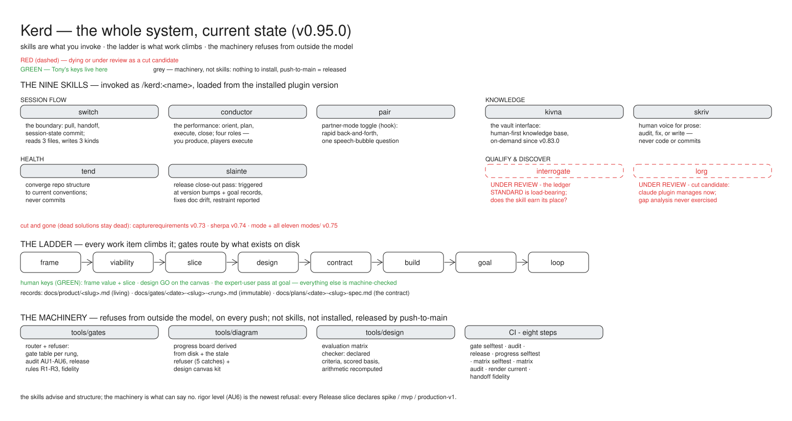

# Kerd

"Ceird" means skill in Gaelic. Respelled.



**What is Kerd?** Nine workflow skills for Claude Code, plus the working method they serve. The skills handle the operational side of working across sessions and machines: when to pull, what to commit, where to put notes, how to audit for drift. Underneath them, every piece of work climbs the same eight-rung ladder (frame → viability → slice → design → contract → build → goal → loop), and the repo carries machinery that can actually say no: gates that route work by what exists on disk, audits that turn silence into a named red light, and a progress board derived from disk rather than self-reported.

**Why should you care?** Because AI-assisted work has a silence problem. Things pass as "done" when nothing was in place to ask the question: was the risk sized? was the background read? was security ever even mentioned? A model choosing to comply is not a check. Kerd's answer is refusal from outside the model: CI that goes red at the exact push that broke a promise, with the fix named in the message. The skills keep you fast; the machinery keeps you honest.

## Install

```
claude plugins add-marketplace anthonymaley/Kerd
claude plugins install kerd
```

## What's New (v0.92.0)

### v0.92.0

**The four roles are renamed, because the old names inverted under reading.** You were the *composer* and the spec-writing agent was the *orchestrator*. In practice that swapped: asked to describe the model, the person who chose those names used "composer" for the spec-writer and "orchestrator" for the driver, in one sentence. Now the names say what the words already mean — **you are the producer** (the idea or the input, and the approvals that keep it the show you wanted to make), the **composer** is the top-tier model called as a subagent to write the score, the **conductor** is the session model directing the performance, and **players** are subagents spun up per step at a sized model and effort. Nothing about the architecture changed: the composer was always Fable, the conductor always Opus, the players always sized — only the labels were wrong. What it means: the model tiers are now stated in the roles table rather than buried in prose, and instructions that tell one role to call another can be written without inheriting a name that reads backwards.

### v0.91.0

**Conductor asks the machine before it asks you, and its commits name what they landed.** Two things a decision from 2026-08-04 had already called for and nothing had built. Before, conductor opened every session by asking you for anything the work might need — including things already sitting on disk, which the entry gates have been able to report since v0.69.0. Now the pre-flight inventory runs `gate.py route` first where a repo has gates, reads what it says, and asks you only for what no file can answer: credentials, hardware state, fixtures. Where no gates exist the behaviour is unchanged. Separately, a work commit running against a contract with numbered pieces now carries a `Piece: <slug>/<n>` trailer — a checked box is a claim, a commit trailer is a fact, and it is the one progress signal that cannot be falsified by ticking a box. What this is *not*, named: the driver. Conductor still does not know which work item it is on or which stage that item is at — that is framed at `docs/product/funnel-driver.md` and deliberately not built here, because conductor is the only working instance of half this system's functions and it sheds one piece at a time.

### v0.89.0

**The session's clock stays honest between phases.** Before, conductor was told once — in a section near the top of its own skill — to write its phase marker to disk. A session that drifted past that one instruction left the marker sitting at an early phase, and close-out then read a stamp that no longer matched reality; on this feature's own first live use the model went one worse and invented a stamp that had never been written. Now the write instruction sits at every phase transition, where the write actually has to happen, and close-out states the consequence plainly: if the marker is not at `execute`, no open time exists, so the session log records a close time alone rather than a plausible-looking range. Gate records gained their missing write-side instruction too — the `**Clock:**` line is now owed by the skill that writes records, not merely documented by the standard that defines it. What it means: the times in your session logs and the durations derived from your gate records come from stamps that were actually taken. What this is *not*, named: a check. `kivna/.active-modes` is gitignored, so no CI step and no hook can refuse a stale marker — this is discipline moved to where it gets used, and its honest test is whether the next session's log carries a real range.

### v0.88.0

**The machine consults a clock, and effort becomes data.** Before, nothing in a session knew what time it was: session logs got headings like "late-evening sitting" written at midday, and how long a task actually took was unrecoverable. Now the clock is captured where artifacts are already written — the conductor's phase marker carries a real stamp (`conductor: execute @ 2026-08-06 15:17 EDT`), which is the task's start; the work commit's git timestamp is its end; session-log headings and the switch-out banner carry real times; and new gate records can carry an optional `**Clock:**` line, so how long a rung took becomes derivable. One rule governs all of it, defined once: a time is written only when a machine produced it in the same turn — a `date` run, or a machine-written record read that turn. A remembered or estimated time is never written. There is also an opt-in statusline segment (`hooks/statusline.sh`) that shows you the time, and **composes** rather than claims the slot — hand it your existing statusline command and it prints both. What you don't get yet, named: estimates. This slice captures honest actuals; using them to predict how long the next task will take is the next slice.

### v0.87.0

**Trim is gone.** The token-cleanup skill's jobs all dissolved into machinery that runs anyway: completed specs are dated immutable records the gates and the progress board read in place (moving them to an archive would turn CI red by construction — the contract and build rungs require them where they are); switch's closure inference cleans TODO with evidence at every boundary; doc-drift pruning belongs to the release pass. What you lose, named: `/trim` no longer answers, and nothing archives docs to `docs/archive/` anymore — deliberately, because nothing should. Kerd is nine skills now. Dead solutions stay dead; the return condition is a cleanup need the boundary, the gates, and the release pass cannot answer.

### v0.86.0

**The release pass now fires when a feature closes, not only when a version ships.** Before, close-out ran the doc-surface pass only if the session's work bumped the plugin version — so the session that lands a feature's goal record (its formal "closed as complete" moment, usually a doc-only diff with no bump) got no pass, exactly when the narrative surfaces most need checking. Now either moment fires it: a version bump, or a goal record landing. One definition of "release" stays (the version-field diff, CI's R1); the completion clause is a second firing moment, not a second release heuristic. What it means: no feature closes without its story being checked.

### v0.85.0

**Releases now check their own story.** Before, slainte was a read-only audit you had to remember to run — and nobody did: the mechanical checks moved into CI, and the judgment layer (does the README still describe what shipped? is What's New honest?) ran never. Now the release moment itself triggers it: when a conductor session's work bumps the plugin version, close-out runs tend's drift check and slainte's narrative pass before the boundary. Slainte fixes what drifted — as normal work commits under the verification gate, with skriv auditing any prose it writes — and its report names what it deliberately left alone, so restraint is visible instead of assumed. The hand-kept `.slainte` config file is gone; audit targets derive from the repo. What it means: the doc surface gets one honest pass per release instead of zero, CI keeps the mechanical layer, and `/slainte` still answers on demand.

*Release notes for v0.84.0 and earlier live in git history — `git log --follow README.md`.*

## Skills

### conductor (Session Discipline)

Conductor gives an open session structure. It runs *after* switch-in has loaded context (switch-in is the session-opener; conductor is the disciplined middle), and walks through: orient (warm path — confirm the state switch-in just loaded; cold path — a light CONTEXT + TODO read if conductor was invoked without switch-in; on a bare repo it offers tend's setup first; **its pre-flight inventory now asks the entry gates before it asks you** — where a repo has them, `gate.py route` names every missing input from disk, and you are only asked for what no file can answer, like credentials or hardware state), plan (decompose the request into scoped tasks with acceptance criteria, approve boundaries, then write concrete implementation steps), execute (do the work, verify each task with evidence before claiming done, escalate after 3 failed fixes), close out (update TODO, confirm docs are current, run checks, fire the release close-out pass when the session bumped the version or landed a goal record, then run the boundary itself — invoking switch out as its final act). It writes the session plan to TODO.md and enforces scope: out-of-plan work goes to backlog immediately, no tangents. Default one task per session.

**Four roles: producer, composer, conductor, players.** Conductor coordinates four distinct roles, and keeping their authority from overlapping is what makes both the quality and the cost work. **You are the producer** — the idea or the input, and the approvals that keep it the show you wanted to make. The **composer** is a top-tier model (Fable) called as a *subagent* to write the score, then gone: it never holds session context, watches the build, or reviews returned work. The **conductor** is the session model you're on (Opus), holding the baton for orient, dispatch, verification and escalation. **Players** are subagents spun up per step at a sized model and effort. The metaphor is load-bearing: a producer decides which show gets made, a composer writes the score, a conductor directs the performance, players play.

Because the hardest reasoning now happens in a *call* rather than in the session, a hard task no longer means running the whole session at premium rates — so the model advisory recommends the **conductor** model (judged on dispatching and evaluating evidence, not on problem difficulty) and never recommends the top tier for difficulty alone. A skill can't read or set its own model, so this stays advice plus a confirmation gate, not detection.

**Work commits name their piece.** When a task runs against a contract with a numbered `## Pieces` checklist, its work commit carries a `Piece: <slug>/<n>` trailer. A checked box is a claim; a commit trailer is a fact — where a repo renders progress from git, the trailer is the signal that cannot be falsified by ticking a box. No contract, no trailer.

**Calling the composer** takes two deliberately small passes. First a scoping pass — intent and boundaries only, answering *what do you need to see?*, bounded to naming files rather than directories. Then the score: conductor fetches exactly what was named and the composer **writes the spec file directly to `docs/plans/YYYY-MM-DD-<slug>-spec.md`, returning only a summary**, so a 200-line score never enters the session's context. The brief carries intent, terrain, constraints and available players — and deliberately not the orient narrative. If top-tier capacity is unavailable, conductor writes the score itself and says so at the gate, so you approve a thinner score knowingly rather than getting one silently.

Steps are tagged `[keep]` (the conductor plays it) or `[delegate]` (assigned to a player, carrying a sized model and effort — `[delegate, model: haiku, effort: low]` up to `[delegate, model: sonnet, effort: high]`). **Tags are assigned after the step body is written, not before**, because writing a slice well is the act that removes judgment from the model and deposits it in the document; the test is whether the step can be written precisely enough to verify by command. Blast radius is answered by adding a `[keep]` step that *reviews the diff for unintended drift* — not by keeping the risky edit, since a mis-scoped deletion is an aim problem and a stronger model has no better aim.

At execute, **the conductor may re-dispatch but never re-specify.** A failing step is either the player's fault (re-dispatch) or the score's; three failures on one step means the score is wrong, and that passage goes back to the composer rather than being quietly rewritten. Verification gained a fifth step — *check for collateral: did anything change that shouldn't have?* — because a verify command tests for the presence of the intended change and is silent about the absence of unintended ones.

The project playbook (`docs/playbook.md`) — a living guide for rebuilding the project from scratch: tech stack, setup, architecture, integrations, gotchas, status — is updated as behavior changes (docs travel with code during execute), and switch captures session gotchas into it at the boundary. It grows with the project, session by session.

**Changes get described in your terms, not the code's.** When a change alters what you can *do*, conductor states it as **now / the change / what it means** — in the vocabulary of using the thing, with paths and symbol names left in the spec and the commit. A removed capability must be named as a loss, because the same removal written as a feature disappears into the good news and gets approved unseen. Questions carry a test: *could you answer this without reading the code?* If not, it's restated as an outcome or recognised as conductor's own call. Framed well, a question needs no options — you answer in your own terms instead of picking from a menu that pre-narrows the space.

**Conductor commits its own work.** As each task's verification gate passes, conductor commits the code and its travelling docs — staged by name, pushed immediately, no approval beat. It never pulls, and never stages session-state files. This exists so you don't have to end a session just to get work committed, and because the collateral check only works on a small diff: a whole session interleaved into one boundary commit is where a swallowed helper hides. Decisions accumulate in CONTEXT.md; conductor doesn't touch the vault or write session logs. At close-out it updates TODO.md, then runs the boundary itself — invoking switch out as its final act, one act instead of two — naming the next pick from TODO and offering `/clear` to free context. Standalone `/switch out` remains for conductor-less sessions.

Conductor is mode-aware: if a mode is active, orient reports the mode context and instruction, the plan respects the mode's scope, and close-out doesn't claim the session is done when running as part of a larger mode flow.

Conductor announces its current phase with a mode marker (`[conductor: orient]`, `[conductor: execute]`, etc.) so you always know what's active. When the session closes, it outputs `[conductor: closed]` so there's no ambiguity. The same marker is written to `kivna/.active-modes` with a real timestamp at every phase transition — that stamp is where the session log's start times come from, which is why the instruction to write it lives at each transition rather than once at the top.

**The gate message carries the content.** Any conductor message that asks for approval contains what's being approved — findings, summary, plan — in that same message, never assuming earlier mid-turn text was seen. This keeps conductor readable under Claude Code's focus mode, which shows only a turn's final message.

**Conductor's gates speak the talk-format library.** A decision gate carries the Proposal fields (what · why it matters · the gap · what we win · **the loss, named**), a change lands as Compare & Contrast (now → the change → what it means), a failure report follows Correcting Discrepancy from Standard (the declaration it failed against → the discrepancy → countermeasure options), and a problem that survives three fixes triggers the problem tier — the declared route for a point-of-cause tool. The formats and their used-when triggers are canonical in `docs/design/talk-formats.md`.

```
/conductor
```

### interrogate (Risk Ledger)

Interrogate qualifies the risks of a plan or idea until every one is sized, evidenced, and left in exactly one state — because a named, unsized risk reads as managed, and that is the failure this skill exists to stop. The interview engine is unchanged: one question per turn, no extrapolation, graduated adversarial lean (gather → probe → stress-test → adversarial), user-veto on stop, deterministic pause/resume from frontmatter session state, and row-by-row recitation before co-sign. The output is the tiered risk ledger: eight columns (Risk / Killer? / Impact / Likelihood / Evidence / State / Countermeasure / Review trigger), five states (Countermeasure — permanent, Countermeasure — TEMPORARY, Accepted, Accepted unknown, FATAL), killer assumption first, always.

Two tiers. Everyday work fills the ledger inside the framing conversation — no skill invocation — directly into the living `## Risk ledger` section of `docs/product/<slug>.md`. A large bet runs the full interrogate session, exhaustive across the viability axes (technical, business, legal, operational), producing a dated session record at `docs/interrogations/YYYY-MM-DD-<slug>.md` whose co-signed ledger is copied into the living section at sign-off. Impact is denominated in the units of the declared value (the `## Value` section of `docs/product/<slug>.md`); FATAL means impact ≥ that value at any likelihood — set by impact alone, never by multiplying in likelihood. Interrogate does not produce the implementation plan — after sign-off the work moves down the walk to slicing and design with its risks pre-chewed, never re-assessed there.

Design at `docs/design/risk-ledger.md`; the interview engine's original design at `docs/plans/2026-05-02-interrogate-design.md`.

```
/kerd:interrogate              # zero-path: interview from an idea
/kerd:interrogate <plan-ref>   # interrogate an existing plan
```

### switch (Session Handoff)

Switch-in owns `git pull`; the Switch Out flow makes the session-state commit — CONTEXT.md, TODO.md, and the session log, committed once at the boundary — and has two callers: standalone, or conductor's close-out invoking it. It is not the only thing that commits: conductor pushes each task's own work as that task verifies, so switch-out finds mostly session state rather than a session's worth of undelivered change. Nothing else pulls. The primary use is session handoff: you wrap up at a clean point, exit, and start fresh later with full context restored from disk. The same operations carry across machines as the secondary case. Switch keeps state, work, and history in three files — `CONTEXT.md` (what's currently true, overwritten in place), `TODO.md` (what's still to do, lean: `## Now` + `## Backlog`), and `kivna/sessions/` (what happened, immutable full-fidelity logs).

When you wrap up a session, it updates CONTEXT.md and TODO.md, runs closure inference over open TODO items — each gets a done/open/unsure verdict against session evidence, shown as a readable list; done items close into the session log, unsure ones get tagged `(done? — confirm)` — writes the session log with branch metadata, reflects on the session (capturing gotchas and learnings, with a check that every gotcha reached the playbook), then shows a pre-commit summary of what's about to ship. Untracked files get triaged (commit, gitignore, or leave) so nothing drifts silently. The final confirmation cites evidence: commit hash, push target, clean tree status.

When you pick up a session, it pulls, verifies the handoff was complete, runs a smoke test if tests exist, then reads exactly three files: CONTEXT.md, TODO.md, and the newest session log — each in full, with no silent shortening. It also recovers **where the work sits on the ladder** from the derived progress board, because the three files carry what was said better than they carry position. Older logs and the vault are never read per-session — session logs are archive, and vault Status.md exists for the human Obsidian reader. It asks one question about any `(done? — confirm)` items, reports any active modes left from a previous session, and tells you where you left off — closing with a short-form "what's next" pick-list — a numbered menu of every `## Now` and `## Backlog` item, one terse line each, so you can pick one by number or steer elsewhere. The first switch-out on a pre-split repo self-migrates the old TODO shape into CONTEXT.md and the session logs (rescue-before-remove), so there's no separate migration step.

If you run it without arguments, it checks for uncommitted changes. Changes present means you're leaving. Clean repo means you're arriving.

```
/switch out          # wrap up (closure inference, reflection, ladder position, commit, push)
/switch in           # pick up (pull, smoke test, CONTEXT + TODO + newest log, ladder position)
```

There is one mode and it is the complete one. The purpose of the boundary is that the next session behaves as if it were the same session with a cleared window, so speed is only ever a tiebreaker between designs that all preserve that — never a reason to record or read less.

### kivna (Knowledge Management)

Kivna owns the project's knowledge layer, stored in an Obsidian vault at `~/eolas/vault/[project]/`. The vault is a human knowledge base. Every file answers a question someone would actually ask. No symlinks, no append-only logs, no session dumps. Files are living, updated in place.

Save (`/kivna save`) updates the vault's Status.md, updates the Weekly tracker (achievements and risks by week for quick status report generation), and writes updates to other vault files (Architecture Decisions, Playbook, etc.) — each change is shown in the save report, no approval prompt; anything marked "don't save this to vault" during the session stays out. Save is deliberate and on-demand — switch no longer calls it at the session boundary (v0.83.0); a vault is exactly as fresh as its last save. Scaffold (`/kivna scaffold`) creates the vault folder and the spine — MOC, Status.md, and Weekly.md — seeded from a short batched intake interview (≤5 open questions, one round), then suggests what other files might fit the project. Import (`/kivna in`) reads files from `kivna/input/` and integrates relevant knowledge, including structured `.kif.json` imports. Export (`/kivna out`) produces two files: `.kif.toon` (token-efficient for LLM handoff) and `.kif.json` (machine-parseable for cross-project import). Exports are repo-grounded: TODO.md, session logs, playbook, and vault status are read first, with conversation context filling gaps.

The folder structure:

```
kivna/
  vault.json   # vault config (points to ~/eolas/vault/[project]/)
  sessions/    # session logs from switch (committed)
  input/       # drop files here for import (gitignored)
  output/      # exports land here (gitignored)
```

```
/kivna in                                          # import from inbox (.kif.json, .md, .pdf, etc.)
/kivna out                                         # export as .kif.toon + .kif.json
/kivna out --full                                  # export all sections (adds playbook, architecture, memory, mode)
/kivna save                                        # update vault
/kivna scaffold                                    # set up Obsidian vault
```

### slainte (Project Health)

Slainte is the release close-out pass, plus on-demand health audits. When a conductor session ships a version bump or lands a goal record, close-out triggers slainte before the boundary: it sweeps the repo's own narrative surfaces — README sections and What's New, the playbook, the state contract, the capability lists, any living design doc the release touched — fixes what is drift, and names in its report what it deliberately left untouched, so restraint is visible instead of assumed. Fixes land as normal work commits under the caller's verification gate, and prose it writes passes skriv's one-shot audit first. The mechanical layer stays CI's (version sync, capability lists, namespaces — R1–R3 and AU1–6); slainte owns the judgment layer: skill-count claims, frontmatter drift, marketplace URL, hook template currency, and cross-doc claim verification. There is no config file — targets derive from the repo.

The on-demand area audits (docs, code, site, deps, playbook, release) still run any time, report-only by default. Everything gets a severity grade: high (factually wrong, broken build, security vulnerability), medium (stale but not misleading), low (nitpick).

```
/slainte docs         # audit docs area
/slainte playbook     # audit the playbook
/slainte release      # the release pass's judgment checks, on demand
/slainte all          # audit everything
```

### skriv (Writing Voice)

Skriv enforces a human writing voice. It has a kill list of words no one actually uses in conversation (leverage, facilitate, delve, holistic, the whole lot), bans all dashes as punctuation (em, en, and double hyphens) along with five-paragraph essay structure, catches synonym cycling and chatbot residue, and runs a self-audit ("what still sounds machine-made?") before cutting 20%. The goal is prose that reads like a first draft by someone who's been in the room, not something generated.

Three modes. Audit reviews a file and reports violations with line numbers. Fix rewrites the file in place. Session mode applies the rules to everything you write for the rest of the conversation. When session mode is on, skriv shows `[skriv: active]` at the top of responses and `[skriv: off]` when it ends.

```
/skriv README.md       # audit against the rules
/skriv fix README.md   # rewrite applying the rules
/skriv on              # session mode on
```

### tend (Structural Health)

Tend audits repo infrastructure against current Kerd conventions and fixes what's drifted. Run it on a new repo to set up everything from scratch, or on an existing repo to catch drift after a Kerd update. It checks nine categories: directory structure, required files, vault integration, deprecated patterns, naming consistency, stray/stale files, .gitignore hygiene, skill hygiene, and hook hygiene.

The report shows each category as passing (✓), failing (✗), or warning (⚠). Failing and warning items get a current-vs-proposed table with reasons. After the report, choose to fix all, pick individually, or skip. Tend makes changes but never commits — unlike conductor's work commits, structural convergence has no verification gate behind it, so it stays in the working tree for you to review.

```
/tend
```

### lorg (Skill Gap Analysis)

Lorg scans the current project and recommends skills or plugins you should be using but aren't. It works in three tiers, each runnable independently. Tier 1 checks what's already installed but underused (not invoked in the last 30 days). Tier 2 searches the Claude Code marketplace and a curated list of repos you maintain for plugins that fit your project's tech and themes. Tier 3 goes wider: GitHub and web search for trending or new plugins you haven't heard of yet.

The default (`/lorg`) runs Tier 1 only: fast, cheap, no web dependency, most actionable. Use subcommands for wider search. Each tier tracks its own freshness date, and running one tier preserves the others in the report.

The recommendations aren't just based on file types. Lorg reads your README, playbook, TODO, session logs, and vault decisions to extract work themes (fundraising, compliance, content creation, whatever keeps coming up). Results are ranked by relevance (theme match + tech match + recency boost - install friction) so the strongest matches appear first. Weak matches below a threshold are dropped.

The report is saved to `docs/lorg-report.md` (committed) and the Obsidian vault (searchable). Updates are incremental: only scanned tiers get overwritten.

```
/lorg                # Tier 1 only (installed but unused)
/lorg installed      # same as default
/lorg available      # Tier 2 (marketplace + curated sources)
/lorg explore        # Tier 3 (GitHub + web). Opt-in research.
/lorg all            # full scan across all tiers
/lorg report         # show last saved report
```

### pair (Partner Mode)

Pair toggles how you and Claude work together. Off by default — the full, show-your-reasoning style stays the resting state so you keep learning. Turn it on to move fast: Claude keeps its thinking internal (surfacing it only when it changes your decision, it's stuck, or you ask), asks one clear question at a time — open by default, offering a tight set of 2-4 crisp options only when a menu genuinely clarifies a choice that's yours to make (never a lazy binary or a vague, verbose list) — interrupts early to flag or check in, and works like someone sitting beside you rather than narrating every step. It's per-repo state (`kivna/.pair`), enforced by an opt-in `UserPromptSubmit` hook that re-injects the partner-mode reminder each prompt while on. Pair governs interaction style only — your `CLAUDE.md` thinking discipline applies either way. (Renamed from `focus` in v0.64.0 to avoid colliding with the harness's native focus mode.)

```
/pair on             # rapid partner mode
/pair off            # back to full reasoning
/pair                # show current state
```

## Hooks

Kerd ships four opt-in hooks that provide session boundary awareness and the pair toggle. They are not active by default. Run `/tend` to register them in your local settings.

**Stop hook:** When a session ends with uncommitted changes or an active mode, prints a one-line reminder to run `/switch out`. Silent when the repo is clean.

**SessionStart hook:** On same-machine resume, checks if the local branch is behind remote, reads the last session date from TODO.md, and reports any interrupted mode. Suggests `/switch in` when there's stale state. Silent on a fresh start.

**Skill completion hook:** When a mode is active and you complete the current step's skill, shows your progress and what's next. Read-only — it never writes `.active-modes`.

**Pair hook (`UserPromptSubmit`):** While pair is on for the repo (`kivna/.pair` = `on`), injects the partner-mode reminder into every prompt. Silent when pair is off or absent. See the pair skill above.

```
/tend                # registers hooks in .claude/settings.local.json
```

**Statusline segment (`hooks/statusline.sh`):** not a hook — it sits beside them and wires into `statusLine`, never into `hooks`. It prints the wall-clock time as `HH:MM`, and it **composes rather than claims** the slot: hand it an existing statusline command as its single argument and it prints `HH:MM · <that command's output>`, forwarding the context JSON on stdin unchanged. Machine-local and opt-in — `/tend` does not register it.

Free slot — point `statusLine` at the script:

```json
"statusLine": {
  "type": "command",
  "command": "/absolute/path/to/Kerd/hooks/statusline.sh"
}
```

Slot already taken — pass the command that is there now as the argument, quoted:

```json
"statusLine": {
  "type": "command",
  "command": "/absolute/path/to/Kerd/hooks/statusline.sh '/absolute/path/to/existing/statusline.sh'"
}
```

Both paths must be absolute and already resolved: `${CLAUDE_PLUGIN_ROOT}` does not expand inside a settings file (the v0.29.1 hook-path gotcha).

The four hooks are covered by a bash test harness, `tests/hooks_test.sh` (26 tests: path resolution under unset/empty `CLAUDE_PROJECT_DIR`, missing-file branches, behind-remote detection, the SessionStart staleness report, and the pair toggle's on/off/absent branches). Run `bash tests/hooks_test.sh` — it shellcheck-lints the hooks as part of the run.

## Entry gates (tools/gates/)

Entry gates route work by construction. Given a work slug, `tools/gates/gate.py` runs the gate table in series and enters at the lowest rung whose declared inputs all exist on disk — front matter, named sections, a qualified risk ledger, a declared rigor level, a checked-box count. It has no opinion on whether a claim is convincing or a design is sound, only whether the artifact is present; a refusal names exactly what's missing for the next rung, never a vague "not ready."

It's the first check in the system that blocks from outside the model. The repo-wide audit (rules AU1–AU6) runs on every push: dated filenames in `docs/design/`, malformed gate records, broken `## Grounding` references, and a `## Release slice` without its `Rigor level:` line all fail the build before a human or a model catches them in review. CI runs seven steps in total — the three gate sweeps plus the progress and matrix checks below.

```
python3 tools/gates/gate.py route <slug>
python3 tools/gates/gate.py check <slug> <rung>
python3 tools/gates/gate.py audit
```

## Progress board (tools/diagram/)

Position is derived, never asserted. `tools/diagram/progress.py` computes every work item's place on the ladder from git log, gate routes, contract checklists, and gate records, and renders it as a committed trio (Excalidraw + SVG + HTML). CI byte-compares a fresh render against the committed pair at every push — a stale board is a red build with the fix quoted. The same kit draws the design packages reviewed on the live canvas.

```
python3 tools/diagram/progress.py          # render the board (three files)
python3 tools/diagram/progress.py stale    # the CI check
```

## Design matrix (tools/design/)

The evaluation matrix is how options are compared — criteria with declared targets and M/D categories set before any option is scored, options as rows each with a drawn architecture overview, Toyota marks per cell (○ = meets · △ = meets only with a named countermeasure · × = cannot meet), scores citing evidence, and a recomputed OVERALL/RANK. The tool refuses what the format forbids: undeclared criteria, scores without basis, △ without countermeasure + confidence, arithmetic drift, and a dead option (× on a Mandatory criterion) named Preferred. Validation fires wherever a matrix section exists in `docs/design/*.md` — on every push, in CI.

```
python3 tools/design/matrix.py check <file>    # validate one design doc
python3 tools/design/matrix.py audit           # sweep docs/design/ — the CI step
python3 tools/design/matrix.py render <file>   # movement-9-style table → .excalidraw + .svg
```

## How They Fit Together

**Starting a project:** Create a repo, clone it, run `/tend`. It checks what's missing, shows you the plan, and sets up the full structure with your approval. Run `/lorg` to find plugins that fit your stack. Then `/conductor` to start your first session.

**Day to day:** You sit down at your laptop and run `/switch in`. It pulls and reads exactly three files — CONTEXT.md (where the project stands, standing decisions, open questions), TODO.md (what's next), and the newest session log (what happened last time). Then it offers to start a conductor session. You run `/conductor` to plan the session. Work happens, decisions get recorded in CONTEXT.md as they're made. When the work is done, conductor's close-out runs the boundary itself — the session log, the state commit, and the push happen as its final act, and the close names the suggested next pick from TODO and offers `/clear`. Run `/slainte docs` any time to check nothing drifted. A session without conductor still ends with `/switch out` directly. The Obsidian vault refreshes only when you ask — `/kivna save`, on demand, whenever you want the export current. Next session, same state, whether you pick up in a fresh session on this machine or on another. Periodically run `/lorg` to check if new skills have emerged that would help with the project.

**On cheap boundaries — a capability that's gone.** Until v0.90.0 you could run `/switch out light` or `/switch in low` to spend fewer tokens at the boundary. Those modes are removed, and that is a real reduction in what you can ask for, not a tidy-up. They went because each one bought its saving by recording less or reading less, and a boundary that records less is exactly how a fresh session ends up contradicting something you already decided. Cost is handled instead by the read set staying at three files and by CONTEXT.md being pruned at goal landings, so those files don't grow without bound. If a boundary feels expensive, the fix is a shorter CONTEXT.md at the next goal landing — not a shallower read.

**The layers:** The session boundary is defined once, in switch — pull on switch-in, the session-state commit at switch out — and has two callers: standalone, or conductor's close-out invoking it. Conductor owns session discipline, commits its own work as it verifies, and closes the session it conducted. Kivna owns the knowledge vault. Above them sits the ladder: every piece of work is a slug climbing frame → viability → slice → design → contract → build → goal → loop, with `python3 tools/gates/gate.py route <slug>` reading what is on disk and naming the rung where the work enters, the progress board showing derived position, and CI refusing at every push what a document promised and the tree no longer delivers. Every skill works standalone.

## Naming

Gaelic-inspired where it adds character:
- **Kerd**: skill (ceird)
- **Kivna**: memory (cuimhne)
- **Conductor**: keeps one session in tempo (renamed from *dian*, Gaelic for intense/rigorous)
- **Skriv**: the act of writing (scríobh)
- **Switch**: session handoff
- **Slainte**: health (slàinte)
- **Tend**: from English "to tend" (care for, maintain)
- **Lorg**: to seek, track down

## License

MIT
