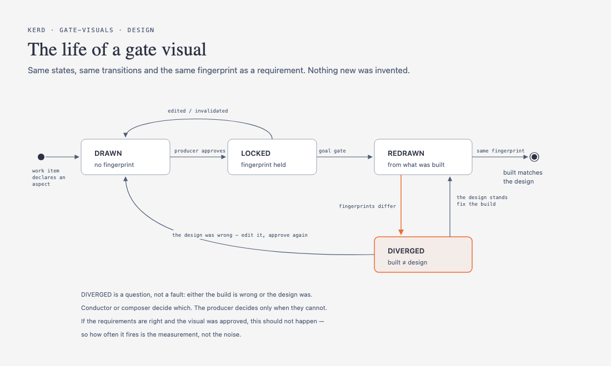
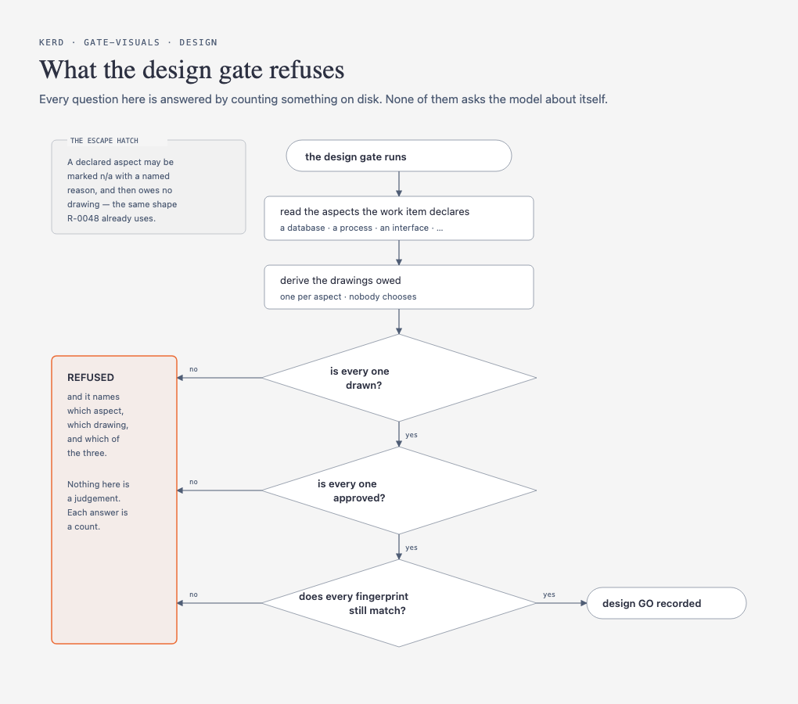

# Gate visuals — design

The design package for `docs/product/gate-visuals.md`. Frame, viability and
slice all pass; this is the design rung.

**Its own drawings are in `docs/design/gate-visuals/`**, and they are the
argument — this file is what a drawing cannot carry.

## Grounding

- `docs/design/talk-formats.md` — the narrative layer this composes with
- `docs/design/diagram-toolkit-spike-findings.md` — the spike that made a
  drawing affordable, and the operator rule that governs every one here
- `docs/design/diagram-types-by-rung.md` — the type-to-rung map
- `docs/design/requirement-shape.md` rule 9 — the fingerprint recipe reused
  unchanged

## The two settled mechanisms

### 1. The life of a gate visual



`DRAWN → LOCKED → edited → DRAWN` is the requirement lifecycle, unchanged.
The only addition is `REDRAWN`, which takes a fingerprint from what was actually
built and compares it to the one that was agreed.

**`DIVERGED` is a question, not a fault**, and it has two exits because which
side is wrong is the thing being decided — the design may stand and the build be
fixed, or the design may have been wrong and need editing and re-approving.
Tony, 2026-08-22: *"yes conductor or composer can validate and decide and if
not, bring the producer in to decide."*

**Its firing frequency is the measurement.** *"If requirments are correct and
visuals are approved then it shouldnt happen."* Same rule as the promotion beat:
a well-run item never trips it, so an item that trips it often has a broken
process upstream rather than a noisy check.

### 2. What the design gate refuses



Three questions, and **every one is a count rather than a judgement** — which is
`R-0051`, already approved: a check binds on countable facts produced outside the
model and never rests on a question the model answers about itself.

The escape hatch is `R-0048`'s shape: a declared aspect marked `n/a` with a named
reason owes no drawing. Skipping stays possible and stays visible.

## Where the aspect list comes from — DECIDED 2026-08-22

The load-bearing question the second drawing deliberately did not answer: if a
work item declares its own aspects in free text, the gate degrades back into a
judgement.

**Tony's answer:** *"does the conductor / composer decide before design based on
the work and agree with producer?"* — yes.

```
  conductor or composer reads the work
        │
        ├── proposes what it touches          the analysis is the model's
        │
        ▼
  the producer agrees the list                the key is his
        │
        ▼
  THE AGREED LIST IS THE DECLARED TRUTH       and the design gate counts
                                              drawings against it
```

This is the contract rung's own rule — *measured against an upstream
declaration* — arriving one rung early, which is what makes the design gate
countable at all.

**The list must be closed.** If a work item can name an aspect nothing maps to,
it owes no drawing and has skipped the gate without ever marking anything `n/a`.
A closed vocabulary plus an explicit `n/a` gives both: every aspect either owes a
drawing or carries a written reason it does not.

The vocabulary is the sixteen rows in the frame's aspect table, **plus a
seventeenth that does not exist yet** — see the open question below.

## Open questions

1. **The UI aspect has no type.** None of the 39 draws a screen — no wireframe,
   no layout, no navigation map, no component hierarchy. Tony named UI alongside
   database and architecture, so this is a gap in a common case, not an edge.
   Under Law 4 it is the fourth and fifth steps: design for the gap, build for
   the gap. **Unanswered here**, and it may turn out a screen is better served by
   something that is not a diagram.
2. **Where the agreed aspect list is stored.** It has to be somewhere the gate
   can read it and somewhere his approval attaches to. The obvious candidate is
   the product doc's front matter, which the gates already parse.

## What this design does NOT do

- **No new approval machinery.** A visual's fingerprint is `requirement-shape.md`
  rule 9, unchanged, over the drawing's content instead of a block's.
- **No board.** Build's visual is derived from disk and therefore cannot be
  approved — nobody authored it, so there is nothing to agree to. Named so nobody
  later "fixes" this by making a fact approvable.
- **No evaluation matrix.** Ours already, machine-checked since v0.77.0.

## The limit, stated

**Nothing here checks that a drawing is a *diagram* rather than a slide.** Both
of this package's own drawings passed the source linter; one of the two earlier
ones passed it, rendered perfectly, and was still prose in rectangles — the
producer's verdict, *"text on the screen with box that made no sense to the
subject"*.

There is no machine check for *does this box mean anything*. The gate can count
that a drawing exists, that it is approved and that it has not changed. It cannot
count that it was worth drawing. **That is the producer's key doing work no
fingerprint can do**, and it is the same declared limit as reachability: the
check proves the artifact is there, never that it was understood.
