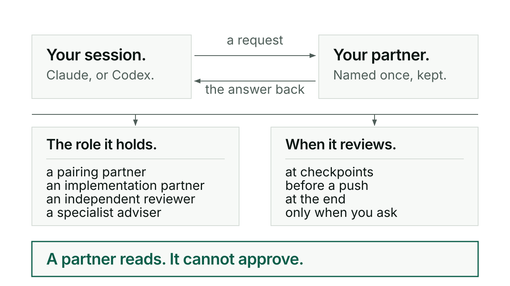

# Agent

Agent gets a contribution from another AI session and brings its answer back:
Claude asking Codex, Codex asking Claude, or either one asking a session that
already has the context you need. It keeps track of which session is which, so
"ask Codex to review this" reaches the partner you paired with rather than a
stranger who has never seen the work.

## When you would reach for it

When you want a second opinion on something before it ships, from a model that
has not spent the last hour convincing itself. When the session that holds the
history of a piece of work is not the session you are typing into. When you want
a standing arrangement, a partner with a role and a review rhythm, instead of
asking for a review each time. And when a job is bounded enough to hand to a
fresh worker that needs no context at all.

## How it goes

You ask in words:

```text
/kerd:agent help
/kerd:agent show sessions
/kerd:agent ask Claude to review, RO
/kerd:agent start a Codex pairing partner
/kerd:agent anything back from Codex?
```

Those are conversational examples rather than fixed subcommands. `/kerd:agent
help` shows a short list first and expands only the part you asked about.

If a partner is already established for this project, that partner is used. No
question, no picking from a list again. If none is established, or which session
you mean is genuinely unclear, you get the sessions that match, led by provider,
whether each is an established partner, its alias and a short ID. The saved native
title comes second, labelled as possibly old, because a session's title describes
what it was doing when it was named and not what it is doing now. Only a session
whose ID matches the host's exactly is marked as this one.

Then a deliberate choice between three things: the existing partner, a new
ongoing partner, or a fresh bounded worker. One is never silently swapped for
another, because an independent read by a fresh worker and a conversation with a
partner who knows the work are different jobs.

When you set up an ongoing partner, you are asked once for two things and then
never again: the role that partner holds, in your own words, and how it reviews.
Four role shortcuts are offered, pairing partner, implementation partner,
independent reviewer, specialist adviser, and any responsibility you name instead
is recorded as you said it. The review cadence has four values: `checkpoints`,
`before-push`, `end`, and `on-request`, which stands alone. You can pick several
of the first three. [Conductor](conductor.md) reads that cadence and plans the
partner's reviews from it.

Underneath, the job is prepared with the relevant source paths, the outcome, the
contribution wanted, the checks, the authority and the stopping point. Before it
goes out you see the partner, the model, the job and the edit boundary. After it
goes out, queued, unconfirmed, running and returned stay distinct, and useful work
continues while the answer is outstanding. Kerd owns the retrieval through to a
complete reply or a stated blocker, because dispatching is not the same as
getting an answer. What comes back is read and assessed, and the useful findings
are recorded beside the work. Private session IDs and raw transport records stay
local.

Sessions are reached through what already exists: native Claude sessions, the
native Codex server, and a Codex terminal you have open, which is queued to
exactly as it stands. Both providers use the CLI sign-in you already have. There
is no relay to copy and paste through, no Kerd inbox, no watcher and no service.

## A short exchange

When a pairing is missing its review cadence, the options are listed with their
meanings and the question comes last, in a speech bubble, the same form every
Kerd question takes. This is the shape, not a transcript:

```markdown
How Codex reviews this work, one or more of:
- checkpoints
- before-push
- end, at the end
- on-request, only when you ask, and on its own

> 💬 **Which review cadence should Codex hold on this project?**
```

Answer in words, or use the picker where your host has one. The picker carries
the same options and never closes off a free-form answer.

## What it will not do

A review request is not permission to edit or publish anything. New partners
start read only, and file edits need the agreed scope and an explicit write
flag.

A peer cannot approve an action waiting on you, and cannot route around a
refusal. The recorded cadence schedules a review inside work that is already
authorized; it grants no work, no contact beyond that, and no commit, push or
release. Those stay yours.

It will not substitute a fresh reviewer for the partner you named. If your
established partner is unavailable, you are told before alternatives are offered.

It will not kill an occupied terminal, resume "latest", fork a session without
saying so, or wake an offline session to make a delivery look successful. Your
own Codex terminal is never resumed, forked or stopped; it is queued to, and
whether anyone is attending it is unknown until it answers.

An empty session list does not prove there is nothing there, and a returned
review is not a passed outcome. Both are reported as what they are.

## For the curious

Roles and session IDs live in private pairing metadata inside the Git worktree,
not in a tracked roster, and neither a role nor an alias grants a permission.
The metadata is local to that worktree; Git does not carry it to another machine.

After a `/clear` or a restart, Agent checks the host's actual session ID rather
than assuming the terminal's lifetime tells it anything. A role designation saved
by the previous session, or your explicit choice of a replacement, lets the
successor take over that binding. Claude can also recover the same role after a
later loss when the saved account and machine match and its predecessor is no
longer listed. That recovers routing, not unsaved work. Codex recovery after a
new ID is not supported.

The Claude launcher currently gives a new partner file tools, not a shell or the
ability to delegate further, so a contribution that needs those has to go another
way. New Claude partners also accept cross-session messages for that session's
lifetime, which is disclosed when the partner is created; other local senders can
then submit under that session's tool permissions.

There is no notification service that wakes a finished turn, so nothing follows
up unattended.

Every command in one line each: [reference](reference.md).


