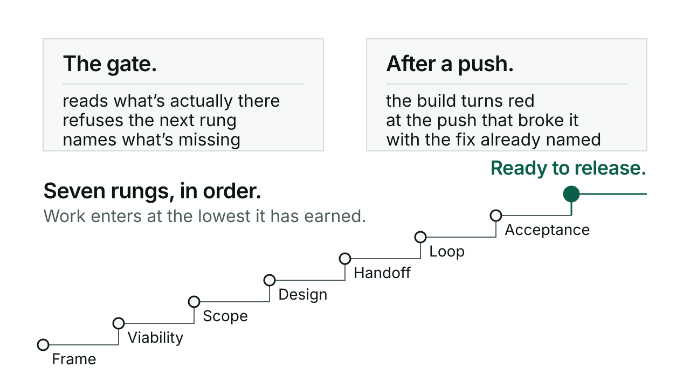

# Checks that can say no

Kerd also carries a set of checks that live outside the model: gates that read
what is actually on disk and refuse to route work past a rung it hasn't
earned, and a CI build that turns silence into a red light. This guide is for
someone who wants to see that machinery: how a work item's position gets
decided, what a gate reads before it lets work through, and what fails a
push. None of it is required to use Kerd day to day. You can use every skill
without ever looking at a gate.

## The problem it answers

AI-assisted work has a silence problem. Things pass as done when nothing was
in place to ask the question: was the risk sized? Was the background read?
Was security ever even mentioned? A model agreeing that something looks
finished is not a check, because it can always be talked into agreeing. Kerd's
answer is refusal that doesn't come from the model at all: a gate that checks
whether a file exists, a section is present, a ledger is filled in, and stops
the work at the rung where it doesn't, before anyone has to trust a claim.

## The ladder a work item climbs

A work item is a slug on `docs/product/<slug>.md`, and it climbs seven rungs
in order. Each one line, what it needs before the next rung will take it:

1. **Frame**: the intent, triaged as new work, a problem, or a question
   (a question exits to conversation, it never becomes tracked work).
2. **Viability**: the framed intent with its value declared in real units,
   so impact can later be measured against something.
3. **Scope**: viability-tested candidates with their risks qualified and
   sized, sliced into a release.
4. **Design**: the intent document backed by measurements and the risk
   ledger, turned into a solution.
5. **Handoff**: a design package that got a go, with its gate record, turned
   into a contract to build against.
6. **Loop**: the contract broken into pieces, each piece built and carrying
   its own check.
7. **Acceptance**: every piece landed and everything declared upstream
   actually true, checked at the goal gate.

An item that has passed acceptance is recorded as ready to release. That is
where the ladder ends, not an eighth rung.

## What the gates read, and what they refuse

`tools/gates/gate.py` is the router. Given a slug, it walks that table and
enters the work at the lowest rung whose declared inputs all exist on disk:
front matter carrying a route and a stage, the named sections present, a
risk ledger that's actually qualified. Missing inputs push work up the
ladder, never through it. The check itself makes no judgment call: it isn't
reading whether a case is convincing or a design is sound, only whether the
artifact is there. A refusal names exactly what's missing for the next rung,
never a bare "not ready."

```
python3 tools/gates/gate.py route <slug>        # reports where work enters; never refuses, always exits 0
python3 tools/gates/gate.py check <slug> <rung>  # the refuser: exit 0 on pass or a declared spike, 1 on refusal
python3 tools/gates/gate.py audit                # repo-wide mechanical sweep; exit 0 clean, 1 with problems
python3 tools/gates/gate.py release               # version sync, capability-list identity, kerd: namespace; exit 0 or 1
python3 tools/gates/gate.py seal <slug>          # closes out hand-written view approvals with a fingerprint
python3 tools/gates/gate.py selftest             # runs the gate's own fixture suite
```

There's one licensed way past the ladder: a spike, declared as such up front
by whoever holds the intent. It's cheap, built only to answer a kill-or-keep
question, and its output never ships. A spike that wants to become real work
re-enters through the gates with whatever it learned as evidence.

Two more tools read and refuse alongside the gate. `tools/diagram/progress.py`
derives every work item's rung from git log, gate routes and gate records,
never from what anyone typed, and renders it as a committed board; CI
byte-compares a fresh render against what's committed, so a stale board fails
the build with the fix already quoted:

```
python3 tools/diagram/progress.py          # render the board
python3 tools/diagram/progress.py stale    # the CI check
```

`tools/design/matrix.py` validates the evaluation matrix any design doc uses
to compare options: it refuses an undeclared criterion, a score with no cited
evidence, a partial mark without a named countermeasure and confidence, drift
in the arithmetic, and an option marked Preferred that fails a mandatory
criterion.

```
python3 tools/design/matrix.py check <file>    # validate one design doc
python3 tools/design/matrix.py audit           # sweep docs/design/
python3 tools/design/matrix.py render <file>   # table to a rendered picture
```

## What CI enforces on every push

`.github/workflows/gate.yml` runs on every push and pull request. In order:
the skill unit tests, the hook test harness, the gate's own selftest, the
repo-wide audit (`gate.py audit`), the release rules
(`gate.py release`), the progress board's selftest, the design matrix's
selftest, a sweep of every matrix in `docs/design/`, a check that the
funnel's step definitions still match the stages the journey diagram
renders, a check that the committed progress board is still the one the
renderer would produce today, and a handoff fidelity check that confirms
whatever a session log claims it produced is actually reachable from what
it named as read. CI runs after the push lands, so it does not stop the push itself: it turns
the build red at the exact push that broke a promise, with the specific fix
named in its output, not a generic failure.

## How Conductor checks where you stand

For a work item with a record in your project, Conductor asks where it
stands at two moments: when it picks the work up, and again the first time a
build starts on it. It identifies the project from `git rev-parse
--show-toplevel`, never guesses or falls back to Kerd's own tree, and if the
work can't be tied to exactly one `docs/product/<slug>.md` file, it says so
and skips the check rather than pretending. Then it runs `gate.py route`
read-only and translates the result into one plain line: which step the work
is on, named by its plain name, and what the next step still needs.

When a build is about to start, the work has to have entered at `loop` or
later. If it hasn't, Conductor names what's missing and offers to do that
groundwork now, rather than starting anyway and hoping it doesn't matter.

Going ahead without doing that groundwork is always your call. Conductor
never refuses it. It writes one dated line into the work item's own record,
naming the step that got skipped, what was missing, and your words for why,
then shows that go-ahead again the next time the item is picked up, so the
shortcut stays visible instead of quietly forgotten. A check that can't run
at all is reported as not checked, never counted as passed.

## Honest limits

A gate checking that a section exists is not the same as that section being
right. Nothing here reads whether a risk ledger's numbers are true, whether a
design is actually sound, or whether a claim holds up; it reads presence, not
quality. And none of this stops a person. It stops an automated build from
proceeding past a rung it hasn't earned, and it stops a push where CI catches
a broken promise, but a human choosing to skip a step and go ahead anyway is
always allowed, recorded rather than blocked. The refusal property is real
for what it covers; what it covers is deliberately narrow.


