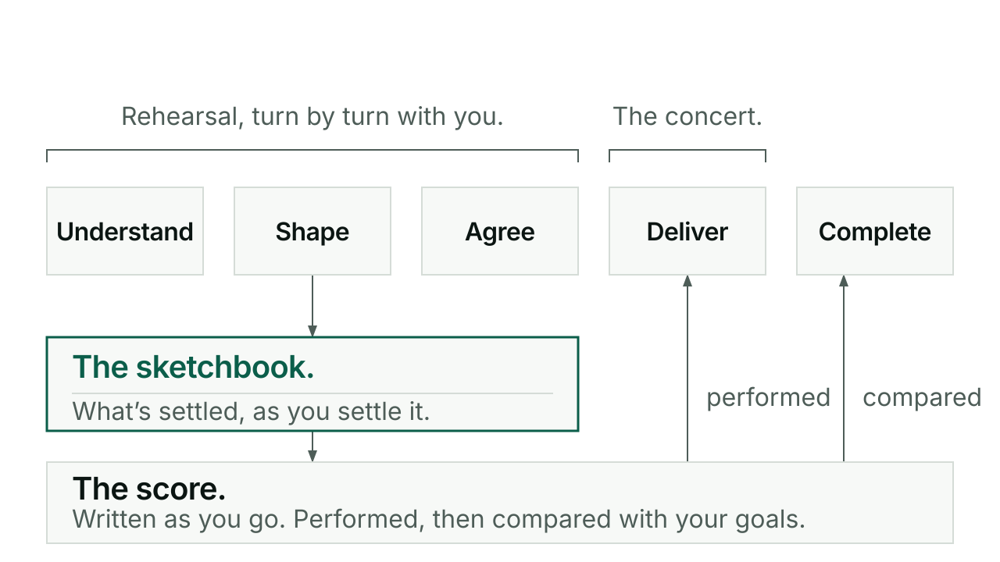

# Conductor

Conductor holds the conversation that works out what you are actually making,
keeps a record of what gets settled as you settle it, and then performs the work
with a team of agents instead of one long chat. It compares the result with the
goals you agreed before it calls the work done.

## When you would reach for it

For a substantial build, design or piece of workflow work, new or already
underway. For work you are not sure how to describe yet, where the useful thing
is being asked good questions. And whenever you answered Switch In's arrival
question with a piece of work, because that answer opens Conductor at Shape for
it. A small standalone fix does not need it, and neither does a status question.
Those stay direct.

## How it goes

There are two ways of working, and Conductor moves between them.

**Rehearsal** is the ordinary one. You and the AI play the work through turn by
turn, in whatever order the conversation takes, shipping as you go. There are no
gates, no ladder and no required sequence. Conductor guides, interviews and
prompts so that between you, you come to hold what a performance would need: the
idea and why it matters, whether it can work and is worth doing, the goals, the
constraints and the design. The AI does the work and you react.

**The sketchbook** is where what gets settled goes. Conductor keeps one per piece
of work, its work record, and writes to it as things are decided. You never fill
in a form. Ask "where are we?" at any point and the answer comes from the
sketchbook in a line or two of plain English: what is settled, what is still open.
Switch Out adds anything a sitting settled that the sketchbook is missing, but the
sketchbook stays Conductor's.

**The score** is written as you go, not in one sitting at the end. Where the
steps are already clear, Conductor writes them itself. Where a passage needs
design or reasoning it cannot settle confidently, it calls a composer to write
that passage and hand it back. The composer writes; it never dispatches anyone.

**Ready** can be called from either side. Conductor says "I think we're ready"
when the sketchbook and score would let players perform without stopping to ask
you, or it names the one or two things still missing: we need the constraints on
X before this is ready. If you call it ready, Conductor tells you honestly what
is still open, and going ahead anyway is your call, recorded in the sketchbook.
Ready is a judgment spoken in conversation, never a checklist handed to you. At
Ready you get a rendered view of what will be built with a short plain summary,
and the go is asked for where you have not already given it.

**The concert** is the performance. Every independent part of the score fans out
to its own player, as many at once as the score allows, each at a model and
effort fitted to its part. When a batch of players returns, Conductor checks each
one's claim against its part of the score. It is not the independent reviewer,
but it never takes a return on trust.

**Batches and rolling.** Results go into the sketchbook, then Conductor looks at
how much room is left in the context window. It either carries on with the next
batch or rolls at the batch boundary: Switch Out, a fresh session, Switch In, and
the next batch starts from the sketchbook and the score under the same agreement,
which is not re-made.

**The goal check** ends it. The goals and checks you set during rehearsal, written
into the score, decide when the work is over. Before the loop closes, Conductor
compares the result with them and shows you that comparison. Work is not done
because the steps ran out. If a gap appears that the score cannot answer, that one
passage stops and comes back to you in the chat, for that one point, not back to
the beginning.

To start, or to resume saved work:

```
/kerd:conductor
```

Every report Conductor gives you has one shape: what you have now and where to look
at it, then where the work stands, then at most five items, with the rest kept in the
sketchbook.

The protocol underneath: Conductor guides Understand, Shape, Agree, Deliver and
Complete. Rehearsal is Understand through Agree; the concert is Deliver. Before
substantial work it shows a short entry line naming the stage, the owner, the
intended result and where it stops. For delegated work it shows a grid of task,
who does it, model, effort and status, with a Fit line giving the reason for each
selection, and it reports the model and effort each job was observed to run with,
because naming a model in a call is a request rather than a guarantee. After each
returned edit it reads the actual change set against a baseline taken before
dispatch. Where you have an established review partner, it plans that partner's
reviews from the cadence recorded with the pairing. See [Agent](agent.md).

For a work item that has a record in your project, Conductor also asks the project
where that item stands, when it picks the work up and before a build starts: one
line on the step the work is on and what the next step needs, an offer to do the
missing groundwork, and a recorded go-ahead if you skip it. That check is the one
place Conductor touches the ladder, and the ladder has its own page:
[checks that can say no](checks-that-can-say-no.md).

## A short exchange

Conductor's questions all take one form: the options, the recommendation and the
consequences sit above, and the question itself is the last line, in a speech
bubble. This is the worked example from Conductor's own presentation guide. Its
facts are fictional, chosen to show the layout.

```markdown
JOURNEY  [NOW: Understand] → Shape → Agree → Deliver → Complete

**What we're building:** an offering and pitch package from the existing material.
Settled: preserve originals; no customer commitments or live publication.

**Proposed scope:** an offering, delivery guide and pitch package.
- Outside this work: live operations, publishing and customer commitments.
- Recommendation: include the guide, so the pitch has a delivery basis.
- Your answer lets me finish the direction and propose its checks.

> 💬 **Is this the right package boundary?**
```

One question, one recommended answer, no menu of alternatives. A clear yes settles
the shown answer. A correction changes it.

## What it will not do

Choosing work in answer to Switch's arrival question selects the work and approves
none of its operations. Opening Conductor is not approval either. Builds,
installs, pushes, live-system queries and anything that costs money each need
their own yes for that actual task. Discussion is not authorization.

Conductor does not review its own players independently. It checks every return
against the score, which is a different job from an independent read, and that
second read comes from a partner. A returned review is not a passed outcome.

It will not drag a small change through an intake, and it will not stop at a
document when implementation is authorized and possible. A build that has to run
unattended uses managed Conductor instead, which currently performs one player at
a time rather than fanning out.

Said honestly: rehearsal and the concert are new in 0.139.0, and the package you
are reading is their first real use. The whole journey has not yet been through a
recorded real-user sitting. Conductor says so if you ask.

## For the curious

Conductor works with four responsibilities when a score is worth writing. The
producer, you, holds intent, priorities and consequential agreement. The composer
writes only the passages it is asked for and returns them. Conductor chooses who
writes each step, writes the clear ones itself, staffs, dispatches, integrates and
judges evidence. Players perform complete steps and return their evidence. These
are responsibilities rather than fixed providers.

Delegation is the default whenever a job can be briefed, checked, and is worth the
cost of handing it over. Only tiny, tightly coupled or judgment-bound work stays
inline, with a stated reason. Every complete step names its intended result, the
exact terrain, its dependencies, the boundary it owns, its authority and what
counts as evidence. That step is the brief; sending it adds only transport facts.

If a player's evidence fails a sound step, Conductor can re-dispatch the same step
with that evidence attached. A defect in the step itself goes back to whoever
wrote it, Conductor or the composer, and is repaired rather than quietly reworded
until a check passes. Changes to outcome, quality, scope or authority come back to
you. The sketchbook lives at `docs/work/<slug>/work.md` by convention, or wherever
the project already keeps its work records.

Every command in one line each: [reference](reference.md).


