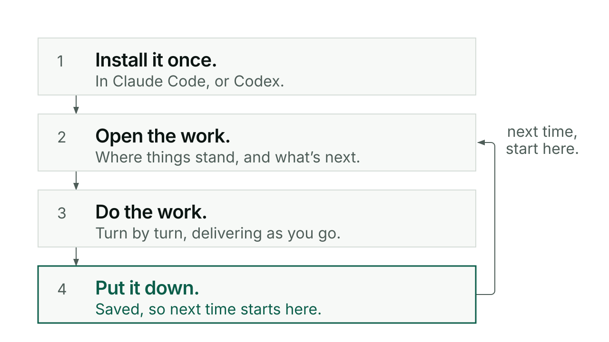

# Getting started

Kerd is a plugin. It does not run on its own: you use it inside Claude Code or
Codex, in a project folder that git is tracking. What it remembers about your
work it writes as ordinary files in that folder, which is why the next sitting
can pick the work up, on this machine or another one. A **sitting** is one
stretch of work, from picking it up to putting it down. Kerd's whole job is to
make the next sitting start where the last one stopped.

There are twelve skills. You do not have to learn them. This page uses three:
tend, switch and conductor.

This page goes from nothing to a first saved sitting. It continues from the
README's [Your first five minutes](../../README.md#your-first-five-minutes),
which is the same journey in one paragraph.

## What you need first

One of the two hosts, Claude Code or Codex. A project folder with git
initialised, because Kerd's save and pickup are git operations and several
checks stop without a repo. Python 3.10 or newer and git on macOS or Linux for
the bundled helper scripts, which is what the packaged core guide states
([START.md](../work/model-ready-work/packaging/START.md)).

You do not need CI, custom hooks, or any wiring inside your own project. Kerd's
own hooks come from the plugin and load themselves when the plugin is enabled.

## Install in Claude Code

```
claude plugin marketplace add anthonymaley/Kerd
claude plugin install kerd@kerd-marketplace
```

To try a version without adopting it, point Claude Code at a local checkout for
one session:

```
claude --plugin-dir /absolute/path/to/kerd
```

A same-name local plugin wins for that session only. Close it and your ordinary
setup is back. Nothing is installed or disabled globally. The README's
[Install](../../README.md#install) section is the source for all three of these.

### Check that it worked

Do this before anything else. A session starting is not evidence that the
install took.

```
claude plugin list
```

Find Kerd in the list. On the machine this page was written on, Claude Code
2.1.278, the entry reads:

```
  ❯ kerd@kerd-marketplace
    Version: 0.139.0
    Scope: user
    Status: ✔ enabled
```

Three things to read there: the name `kerd@kerd-marketplace`, the version you
meant to install, and a status of enabled. If Kerd is not in the list at all,
the install did not finish and nothing further on this page will work. If it is
listed but not enabled, the skills will not load either.

## Install in Codex

Be careful here, because the Codex side is not a finished product page. What the
repo actually documents is a build-then-install route in
[START.md](../work/model-ready-work/packaging/START.md), a guide written while
the Codex work was being done.

What that guide establishes:

The Codex package is a **core of four skills**: Conductor, Switch, Visuals and
Agent. The other eight skills and all Claude hooks are deliberately left out and
are not claimed to work in Codex. Do not replace a full Claude install with it by
accident.

You build the package yourself from a source checkout of Kerd. The guide's
example is:

```sh
python3 docs/work/model-ready-work/packaging/build.py output/kerd-codex-0.113.0 --codex-marketplace
```

The destination must not already exist. Building installs nothing and contacts
nobody. Then, with your approval for a user-level install, you register that
generated catalog root and install from it:

```sh
codex plugin marketplace add /absolute/path/to/kerd-codex-0.113.0
codex plugin list --marketplace kerd-core --available --json
codex plugin add kerd@kerd-core
```

The path is the catalog root, not its `plugins/kerd` subdirectory. If `kerd-core`
already points somewhere else, sort that out first rather than overwriting it.

Three honest limits. `0.113.0` in those paths is the version the guide was
written against; the current release is 0.139.0, so the directory name is an
example and not a version to copy. There is no published git marketplace for
Codex, only this local catalog you build and keep, so Claude updates do not
update Codex and each new release means a fresh catalog directory. And
`/kerd:switch` and its siblings are Claude Code commands, not a promise of the
same slash commands in Codex: in Codex you select the Kerd skill and ask in
words, for example "Switch in." or "Use Kerd Conductor to help me build …".

What is **not documented anywhere in this repo**: any prebuilt Codex artifact you
can install without a source checkout, and any Codex install route that does not
go through `build.py`. If you want one of those, it does not exist yet. Ask
rather than guess a command.

## If this project has never used Kerd

Do these in order. Everything after step 3 is what an ordinary day looks like;
step 3 is the one you do once per project.

1. Install Kerd in your host.
2. Confirm it is there with `claude plugin list`.
3. Run `/kerd:tend` in the root of the git repo, to set the project up.
4. Run `/kerd:switch in` to open the sitting.
5. Do the work, with Conductor.
6. Run `/kerd:switch out` to put it down.

Skipping step 3 is the mistake worth avoiding. The first `/kerd:switch in` in a
repo that has never used Kerd has nothing to restore, and it says so rather than
manufacturing work for you. It adds no discovery or setup step of its own, and it
still ends on the same question. So you get an arrival screen that is honestly
empty, which is confusing the first time.

### Step 3 in full: what tend does

```
/kerd:tend
```

Run it in the root of the git repo. Tend audits the repo against current Kerd
conventions across nine categories (directories, required files, vault
integration, deprecated patterns, naming, stray and stale files, `.gitignore`,
skill hygiene, hook hygiene) and shows a report where each category is passing,
warning or failing, with a current-versus-proposed table and a reason for
anything that is not passing. Then it asks:

> 💬 **Fix all of these?**

Your options are fix all, pick individually, or skip. On a brand new repo with no
README, CLAUDE.md or `docs/`, it asks once for a project name and a one-line
description, then creates the structure from templates. On an existing repo it
only reports what is missing and leaves the writing to you.

Tend changes files and stops. It never commits: structural convergence has no
verification gate behind it, so it stays in your working tree for you to read.
When it has just built a new repo's structure it suggests running
`/kerd:conductor` to start your first session, or `/kerd:switch out` to commit
and push.

Two things worth knowing on a fresh project. If there is no `.git`, tend stops
and tells you to initialise a repo and set up a remote first. And the Obsidian
vault is opt in: no `kivna/vault.json` is not a finding, it is one information
line, and `/kerd:kivna scaffold` sets one up when you want it.

## Your first sitting

### Open the work

In the repo you want to work in:

```
/kerd:switch in
```

Kerd restores what the project already knows and shows you an arrival screen in
plain English. It opens with a one-row grid: PROJECT, PHASE (where the
recommended work sits), NEXT (the recommendation) and TEAM (any Claude or Codex
partner it restored). Under it, in this order: where things stand in product
terms, what changed last session, the open work one line each, and one
**Recommended** item with the **Why** it comes first. ATTENTION appears only when
something limits the recommendation or the restore. It closes with links to the
documents the work already names.

Here is a real one, shortened: the arrival from the sitting that made these
guides, in the Kerd repository on 2026-09-18.

> **KERD · SWITCH IN COMPLETE ✓**
>
> | PROJECT | PHASE | NEXT | TEAM |
> | --- | --- | --- | --- |
> | Kerd | released, not yet seen in use | Rehearse one real piece of work with 0.139.0. | Claude (build and release) + Codex (expert review) |
>
> **Where things stand:** Kerd 0.139.0 is out … It is wording only and nobody has
> used it on real work yet.
>
> **Open work**
>
> 1. Rehearse one real piece of work with 0.139.0 …
>
> **Recommended:** Rehearse one real piece of work with 0.139.0.
>
> **Why:** … it has no test, so only a real sitting shows which.
>
> > 💬 **Start a Conductor session?**

The last line is one question:

> 💬 **Start a Conductor session?**

**What that question means.** It opens work. It approves nothing. Answering it
with a piece of work, a plain yes included, opens Conductor at Shape for that
work, which is the conversation about what you are making and why, before
anything is built. It does not approve a build, an install, or a push, even when
the recommendation is worded like an action ("Release 0.139.0"). Those need their
own go-ahead later.

Where your host shows a picker you get two options, "Yes, <the recommended
work>" and "Something else", and you can still type an answer of your own. Pick
"Something else" and Conductor opens by asking what you want instead. Saying "not
now" starts nothing.

If what you actually want is not on the list, just say it. Switch weighs every
open item and the saved next step is only one candidate, never repeated because
it was saved.

### Work

Most work is **rehearsal**: you and Conductor playing it through turn by turn, in
whatever order the conversation takes, shipping as you go. No gates, no required
sequence, no form to fill in. Conductor keeps a **sketchbook**, one running record
per piece of work, written as things get settled, so at any point you can ask
where things stand and get a line or two back: what is settled, what is still
open.

You talk to it in ordinary language. This documentation package started with one
loose sentence from its owner: make Kerd a packaged product, with a website,
documentation, examples and a README, using Conductor and agents. Conductor did not
start writing. Its first question back was who the package was for, and the answer,
developers, product people and anyone using AI to produce meaningful output, was
written down as the audience for everything that followed.

That is the shape of it. You say what you want in your own words, Conductor asks
the one thing that changes what gets made, and the answer is written down where
the next sitting can read it.

**Ready** can come from either side. Say "I think we're ready" and Conductor says
honestly what is still open; going ahead anyway is your call, and it gets
recorded. At Ready you are shown a rendered view of what will be built with a
short summary, and asked for the go where you have not already given it. After
that the work is performed as a **concert**: the agreed plan is written down as a
score, handed to several agents at once, and each return is checked. The result is
compared with the goals you agreed before it is called done.

Small work never needs any of that. It just gets delivered.

### Put it down

```
/kerd:switch out
```

Out reads what actually changed, writes the session's account, adds what the
sitting settled to the sketchbook, and saves the place: the next action, where
the scope stops, any pending question.

It ends on a closing box that starts with the save state in words: SESSION SAVED,
SAVED LOCALLY, NOT SAVED, or SAVE STATUS NOT RECORDED. Then a project, saved,
phase and released grid, what changed this session in product terms, the next
step and why, and any save problem under Attention. Only after a confirmed save
does it offer the restart line: "Exit and restart or /clear and `/kerd:switch in`
to pick up from here."

Read that first word before you close anything.

## What appears in your repo, and who commits it

Kerd's memory is plain Markdown in your project. Nothing is hidden, nothing is
binary, and you can open all of it in an editor:

- `CONTEXT.md`, what is currently true about the project. Overwritten each
  sitting, never a diary.
- `TODO.md`, the open work: `## Now` for the current focus, `## Backlog` for what
  is queued.
- `kivna/sessions/YYYY-MM-DD.md`, one dated log per day of what was done,
  decided and committed. Append-only, never rewritten.
- `docs/work/<slug>/work.md`, one record per piece of work. This is the
  sketchbook Conductor keeps.

One file is deliberately not committed: `kivna/.active-modes`, which holds
per-session mode state and is gitignored.

Switch Out is the part that commits those files. It names the files it is
saving and commits those, and it pushes when pushing has been authorized;
a local-only save is a valid outcome, not a failure, and the closing box tells
you which of the two happened. Conductor commits the work itself as it goes, per
task that passed its verification. Tend commits nothing at all. If none of that
is what you want, do not run Out, and commit by hand.

What it costs to run, rehearsal against a concert, is in the README under
[What it costs](../../README.md#what-it-costs).

## Taking Kerd out again

```
claude plugin uninstall kerd@kerd-marketplace
```

That is the command the CLI's own help describes (`claude plugin uninstall|remove
<plugin>`); it has not been run against this page. Your project keeps everything
Kerd wrote. `CONTEXT.md`, `TODO.md`, the session logs and the work records are
ordinary files in your repo, and removing the plugin does not touch them. They
stay readable, and they stay in git history, whether or not Kerd is installed.

## When something is missing, or goes wrong

**The skill does not appear.** Check what is installed rather than assuming.
Claude Code lists plugins with `claude plugin list`; in Codex open `/plugins` in
the CLI or Plugins in the app and confirm the installed version and that the four
core skills are listed. A session starting is not evidence the plugin installed
or updated. If automatic selection misses the skill, select it explicitly.

**Out says NOT SAVED or SAVE STATUS NOT RECORDED.** No restart line is offered,
on purpose. Keep the session open and resolve the save first. Clearing context at
that point would lose the work that is not saved.

**ATTENTION on arrival.** That panel carries material limits: a failed
synchronisation, a contradiction that matters, a decision recorded as made when
it was not. Read it before you accept the recommendation. Ordinary owed work is
not put there; it stays in Open work.

**An old repo fires hooks twice, or not at all.** Kerd's hooks have auto-loaded
from the plugin since v0.96.0. Repos that were wired by hand before that may
still carry entries in `.claude/settings.local.json` pointing at a cached plugin
version that has since been pruned. `/kerd:tend` finds those and removes them;
nothing replaces them, because the plugin supplies the hooks itself.

**Pair is on but nothing changes.** The partner-mode reminder is re-injected by
an opt-in `UserPromptSubmit` hook. Without it the toggle still records state, but
nothing reminds each turn. Tend installs it.

**A diagram cannot be drawn.** Visuals needs diagram-design or Archify. If
neither can run on your machine it says plainly that the view is not rendered and
what that costs, instead of drawing something by hand. Installing a missing tool
still needs your approval.

**Something is genuinely missing from the record.** A gap is a gap. Kerd's rule
is to show it rather than invent memory or assume you approved something, so an
arrival that says "I can't establish X" is working correctly. Answer it and carry
on.

## Rolling back a version

Roll back by pinning the marketplace to a git reference, never by trusting an old
copy in Claude Code's plugin cache, because that cache gets garbage collected and
the version you can see today may be gone tomorrow. The README's
[Rolling back](../../README.md#rolling-back) section carries the exact references
to use and the warning that this repo has no tags yet, so a commit SHA is the
only durable thing to cite today.

## Where to go next

Every command in one line each: [reference](reference.md).

The capabilities, one page each: [switch](switch.md), [conductor](conductor.md),
[visuals](visuals.md), [agent](agent.md), [pair](pair.md),
[interrogate](interrogate.md), [tend and slainte](tend-and-slainte.md),
[lorg](lorg.md), [kivna and skriv](kivna-and-skriv.md).

If you want the parts that can refuse from outside the model, the entry gates and
the CI checks: [checks that can say no](checks-that-can-say-no.md).


