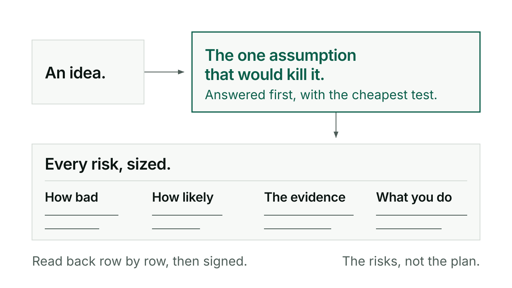

# Interrogate

Interrogate interviews you about a plan or idea until every risk in it is qualified: sized, backed by evidence, with a severity and a treatment stated. A risk that is named but not sized reads as managed when it is not, and that is the failure this skill exists to stop.

## When you would reach for it

Reach for it before you spend real money or real time on a bet: a plan whose risks have never been pinned down, an idea you are not sure is viable, an assumption you have been taking on faith. Small everyday work does not need the full skill at all, its ledger gets filled inside the ordinary planning conversation.

Interrogate produces the risk ledger, not the plan itself. Once it is signed, the work moves on to slicing a release and designing the solution with its risks already understood, never re-litigated there.

## How it goes

Start from an existing plan or from nothing:

```
/kerd:interrogate <plan-ref>
/kerd:interrogate
```

With a plan reference, Claude reads it, proposes the viability axes it can infer from the content, and asks you to prune which stay in scope. Starting from zero, it asks one open question, "what's the idea?", and builds the document from there.

Either way, the first thread is the value the idea is meant to create, because impact has no units until that is declared. Then comes the killer question: the one assumption that, if false, kills the whole thing. That row is resolved first, with the cheapest test that can decide it.

From there the interview runs one question per turn, open ended by default, drilling into vagueness rather than accepting a vibe word. The tone escalates on its own as the session goes on, gathering early, probing once real detail starts to surface, stress testing and then turning adversarial as the ledger fills in. You can dial that level up or down at any moment. Nothing is declared done by Claude; you say stop, or the ledger passes its qualification check and Claude proposes moving to recitation, where every row gets read back to you one at a time for confirmation before anything is signed.

Sessions can run long, and the document itself is the state. Leave and come back later and Claude resumes from what is on disk, not from what it remembers of the conversation, re-asking the last unanswered question verbatim before carrying on.

## An exchange

> 💬 **What is the one assumption that, if false, kills this?**

Later, once the ledger looks complete:

> 💬 **I've exhausted my known unknowns; ready to enter recitation?**

You can still say there is more to discuss. And in recitation itself, row by row:

> 💬 **Does this row read right?**

## What it will not do

Interrogate does not produce the implementation plan. It produces qualified risks, nothing more, on purpose, so that design work never sneaks into the interview before the risks are actually understood. It does not decide when the session is over: only you can call it done, all the way through the final sign-off. It does not use multiple choice as a way to skip thinking, open questions are the default and a menu only appears when the choice is genuinely small and discrete. And it never multiplies impact by likelihood to get a comfortable average; impact alone sets whether a risk is fatal, likelihood only changes how you respond to it.

## For the curious

Everyday risk work lives directly in the `## Risk ledger` section of a project's `docs/product/<slug>.md`, overwritten in place as things change. A large bet gets its own dated session at `docs/interrogations/YYYY-MM-DD-<slug>.md`, frozen once both of you sign it, with its ledger copied into the living section at sign-off.

Every row carries ten columns: Risk, Killer, Impact, Likelihood, Risk evidence, Severity, Treatment, Countermeasure, Treatment evidence, Review trigger. Severity is fatal or non-fatal, set by impact alone. A fatal row cannot be closed by acceptance, only by a real countermeasure or by killing the idea outright. Full command reference: [reference](reference.md).


