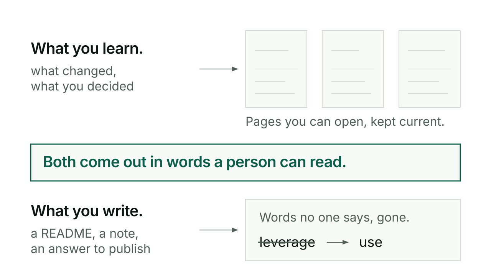

# Kivna and Skriv

Kivna keeps what you learn about a project in a human-readable Obsidian vault, updated in place rather than piled up in dated logs. Skriv keeps your writing sounding like a person wrote it, auditing or rewriting prose against a kill list of words no one actually says and a set of structural tells that give an AI away.

## When you would reach for it

Reach for kivna at a natural breakpoint, after finishing a task, before context gets long, when something important gets decided, to save the current state to the vault. Reach for skriv whenever a piece of prose needs to read like a first or second draft by someone who has actually been in the room: a README, a doc, an answer you are about to publish somewhere.

## How kivna goes

```
/kerd:kivna save
/kerd:kivna in
/kerd:kivna out
/kerd:kivna out --full
/kerd:kivna scaffold
```

Save updates the vault's Status page and Weekly tracker to reflect the session, and writes anything else that surfaced, no approval prompt beyond your own do-not-save markers during the session. Save is deliberate and on demand, the vault is exactly as fresh as its last save, nothing refreshes it automatically. In reads files dropped in `kivna/input/` and asks before writing anything into the project. Out exports the project's current context as two files in `kivna/output/`, a token-efficient one for handing to another session and a machine-parseable one for import elsewhere; `--full` adds playbook, architecture, memory, and mode. Scaffold sets up the vault folder itself, seeded by a short batched interview, five questions at most, one round, not drilled one at a time.

## How skriv goes

```
/kerd:skriv README.md
/kerd:skriv fix README.md
/kerd:skriv on
```

Plain `/kerd:skriv <file>` audits a file against the rules and reports violations by line number, without touching anything. `fix` rewrites the file in place and then cuts 20 percent, removing any sentence that only restates a point already made. `on` turns session mode on for the rest of the conversation, applying the rules to everything written from then on; `off` turns it back off. Session mode shows `[skriv: active]` at the top of every response while it runs.

## An exchange

A kivna Weekly entry, in its own real shape:

```
### Achievements
- Shipped weekly tracker feature in Kivna (v0.14.0)
- Resolved vault path migration to ~/eolas/vault
```

A skriv audit finding, in its own real shape:

```
Line 12: "leverage" (kill list word). Try: "use" or "build on"
Line 28: dash used as punctuation. Replace with the punctuation you actually mean
```

## What kivna and skriv will not do

Kivna does not scan the repo's files to build the vault, it writes knowledge in human form, not mirrors of machine-readable files, and it never symlinks to the repo. It does not append to a growing log either, files are living and get overwritten as the project moves. Skriv only touches prose, never code, commit messages, or technical discussion, and outside session mode it will not rewrite anything you did not ask it to fix.

## For the curious

Kivna's vault has one spine per project, a map of content file plus a Status page plus a Weekly page, and every other file in it is self-identifying by name so it never collides with another project's vault entry. Skriv's rules cover a full vocabulary kill list, banned dash punctuation, and a self-audit pass, "what still makes this sound machine-made", before the cut. Full command reference: [reference](reference.md).


