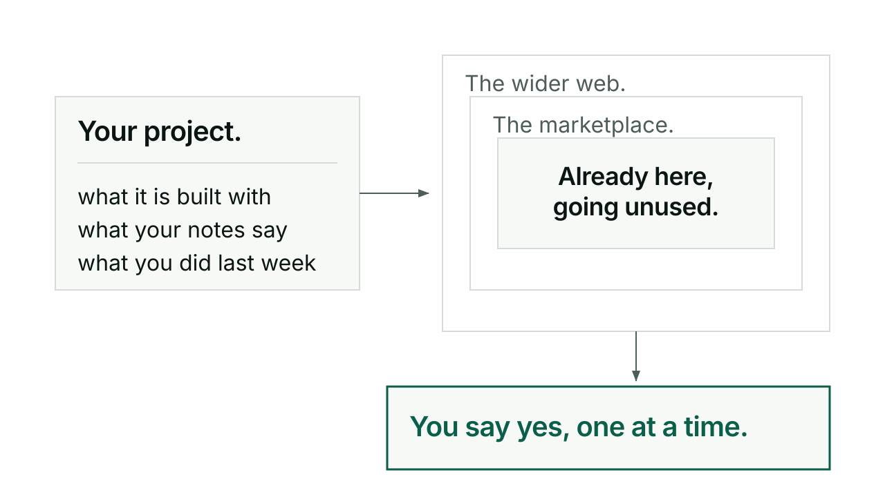

# Lorg

Lorg scans your project and tells you what skills or plugins would help that you are not using. It reads your tech stack and your prose, README, playbook, TODO, session logs, for recurring themes, and matches them against what is installed, what is on the marketplace, and what is out on GitHub.

## When you would reach for it

Reach for the default tier during normal work, it is cheap and fast and tells you what is already installed but sitting unused. Reach for the wider tiers before spending time hunting for a tool you suspect exists but cannot place, or on an occasional sweep, after a release or roughly once a month, to see what is new.

Lorg is not a general search engine for plugins. It only surfaces something once it can point at a real signal from your project, a theme in your README, a pattern across recent sessions, tying the match to what you are actually doing.

## How it goes

```
/kerd:lorg
/kerd:lorg installed
/kerd:lorg available
/kerd:lorg explore
/kerd:lorg all
/kerd:lorg report
```

The plain command and `installed` both run tier 1: skills already installed but not used in this project in the last 30 days. `available` adds tier 2, the Claude Code marketplace plus any curated repo list you keep. `explore` adds tier 3, a wider GitHub and web search for things you have not heard of. `all` runs every tier. `report` just shows the last saved scan without running a new one.

Every match comes with a relevance score built from how well it matches your project's themes and tech, whether your own notes mention needing it, and how much friction installing it would add. Weak matches get dropped rather than padding the list. After the report, Lorg walks through each new item one at a time and asks what to do with it, never as a batch.

A plugin or skill only ever shows up once across the three tiers. If something already installed would also turn up as a marketplace match, the installed tier wins and the duplicate is dropped before you see it.

## An exchange

For something already installed, the walkthrough asks:

> 💬 **Shall I show how to use [skill] in this project?**

For something on the marketplace but not installed:

> 💬 **Shall I install [plugin]?**

And Lorg only installs on approval, one at a time; it never installs anything on its own.

## What it will not do

Lorg does not auto-install anything, every install is asked for and approved individually. It does not suggest removing anything either, a skill unused here might be essential somewhere else, so it finds gaps, never waste. It is not a health check: structure is tend's job, content accuracy is slainte's. And it does not save a project profile between runs, the profile is computed fresh each time because projects change and a stale one would mislead you.

## For the curious

The report is written to two places, `docs/lorg-report.md` in the repo so it travels with git, and a matching file in the Obsidian vault so it is searchable there too. Each tier keeps its own last-scanned date, and running one tier leaves the others exactly as they were.

The relevance score is theme match plus tech match plus a recency boost, minus install friction, and anything scoring below the threshold is dropped before you ever see it. The "why here" line on each match has to cite something concrete from your own project, a README line, a TODO item, a pattern across recent sessions, never a generic description of what the tool does. Full command reference: [reference](reference.md).


