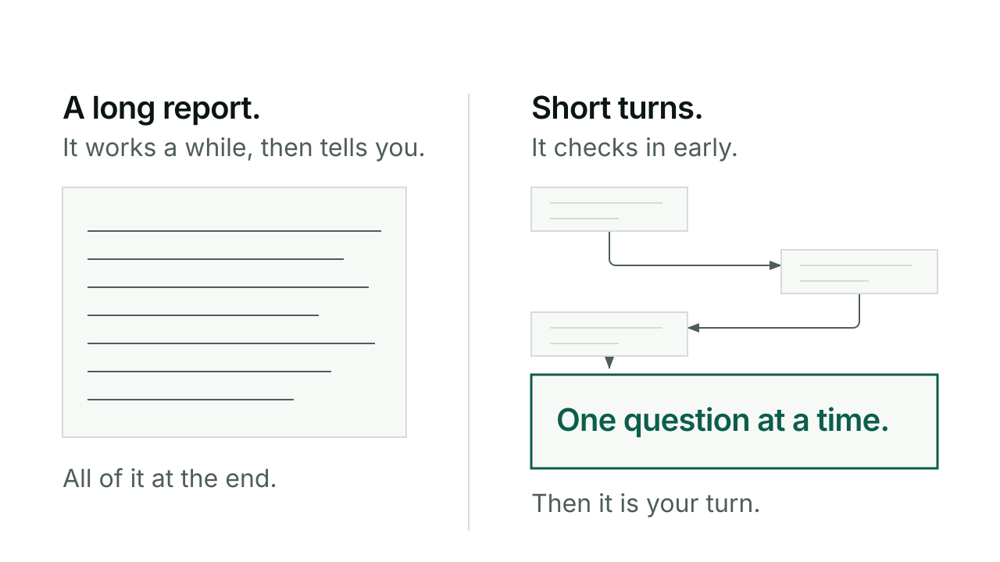

# Pair

Pair changes how Claude works with you inside a repo, not what it can do. Turn it on and Claude keeps its reasoning to itself, asks short questions instead of long ones, and checks in early instead of working alone for a while and reporting back.

## When you would reach for it

Reach for pair when you want rapid back and forth instead of long written reports: sketching an approach out loud with someone, deciding as you go, changing your mind mid-thought. Leave it off, its default, when you want the full show-your-reasoning style, because that is how you keep learning what Claude is actually doing and why.

## How it goes

Turn it on for the repo:

```
/kerd:pair on
```

Claude confirms with `[pair: on]` and from that point follows the partner-mode rules for the rest of the session. Reasoning stays internal unless it changes your decision, Claude is stuck, or you ask to see it. Questions come one at a time, shaped as a single speech bubble line. Claude interrupts to ask or flag the moment it needs your input, rather than saving it all for the end.

Check the state at any point:

```
/kerd:pair
```

Turn it off when you want the fuller style back:

```
/kerd:pair off
```

The toggle is per repo. It stays set until you change it.

## An exchange

With pair on, a short rhetorical aside is fine on its own, "huh, that's why X", just enough to make the point, and then a question shaped like this:

> 💬 **The question?**

Any options or context Claude wants to give come above that line, never packed inside it. If several things are open, Claude asks the one that most blocks progress, not all of them at once.

## What it will not do

Pair does not change your CLAUDE.md thinking discipline: the instruction to grasp the situation and say what it does not know applies whether pair is on or off. It does not turn into a rigid protocol either. You can pull Claude deeper into detail at any moment, and it will still surface anything genuinely important even with pair on. And it does not turn multiple choice into a shortcut: a 2 to 4 option menu only appears when it clarifies a real choice that is yours to make, never a lazy binary standing in for a call Claude should just make itself.

## For the curious

Pair is enforced by a `UserPromptSubmit` hook that reads a per-repo flag, `kivna/.pair`, and re-injects the partner-mode reminder into every prompt while it is on. The hook is opt-in, installed through `/kerd:tend`. Without it the toggle still records state, it just will not keep reminding Claude turn after turn.

The flag itself is gitignored, ephemeral state, a single word, `on` or `off`, absent meaning off. The skill used to be called focus, renamed to pair to avoid colliding with the harness's own native focus mode. Full command reference: [reference](reference.md).


