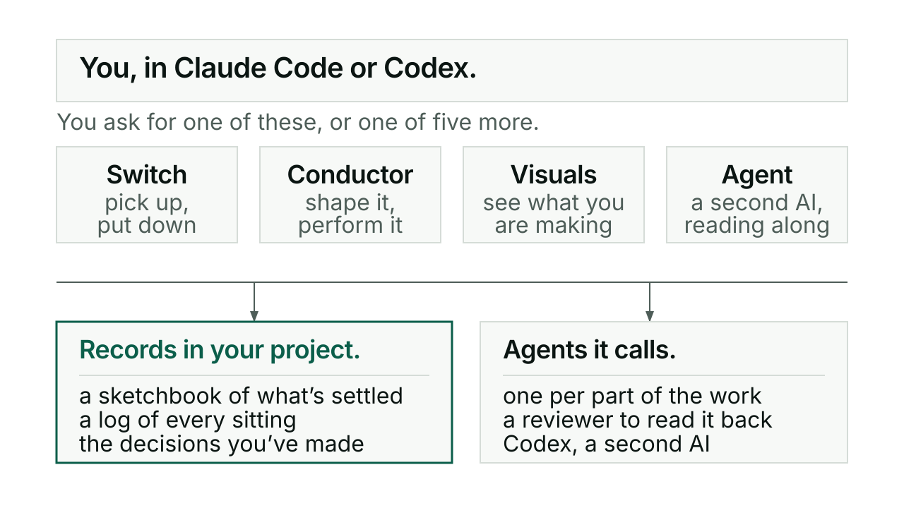

# Reference

Every command Kerd's skills accept, one line each, grouped by skill. Each line
comes from that skill's own `SKILL.md` or the reference files beside it, so where
this page and a skill file disagree, the skill file is right.

Not everything here is a slash command. Several skills take conversation instead,
and two carry helper scripts you can run yourself. Both kinds are marked.

New to Kerd? Start with [getting started](getting-started.md).

## Switch

Saves, restores and moves repo-based work between sittings and devices.

- `/kerd:switch in` restores memory and pairing, weighs the open work and shows
  the arrival screen, ending on "Start a Conductor session?".
- `/kerd:switch out` closes the sitting: the account, the sketchbook update, the
  next action and its approval boundary, then the saved-place box.
- **To** is a named action, not a slash command: save the exact mid-work position
  through GitHub, release source control, restore at the other device.
- **Roll** is a named action too: carry an authorised Conductor build into a
  fresh context window without a new interview or go-ahead.
- `python3 /path/to/switch/scripts/roll_status.py --project /path/to/project`
  prints a read-only view of a managed run: recorded state, next action and
  finished workers, without private session IDs.

Guide: [switch](switch.md).

## Conductor

Guides a piece of work through rehearsal and, when you are ready, the concert.

- `/kerd:conductor` starts a session, or resumes saved work.
- Conductor takes conversation rather than subcommands. Asking where things
  stand gets a line or two read back from the sketchbook. "I think we're ready"
  calls **Ready**, which is a judgment spoken between you, never a checklist.

Guide: [conductor](conductor.md).

## Visuals

Draws readable product, process and system views with diagram-design or Archify.

- `/kerd:visuals` draws the thing being discussed.
- No subcommands. Since v0.132.0 you do not have to ask: a proposal carrying two
  or more connected parts, a branch, an ownership boundary or a before and after
  change gets a view by default.

Guide: [visuals](visuals.md).

## Agent

Connects Claude and Codex sessions so one can contribute to the other's work.

- `/kerd:agent help` shows the short help list from the user guide. Help alone
  discovers nothing, pairs nothing and launches nothing.
- `/kerd:agent <request>` carries the request in words. The examples in the user
  guide are "Show sessions", "Ask Claude to review, RO", "Pair with Codex on
  this", "Use Claude as the implementation partner and Codex as reviewer",
  "Start a fresh Claude reviewer", "Start a Codex pairing partner", "Anything
  back from Codex?" and "Connect Codex". They are examples, not fixed
  subcommands.
- `scripts/agent.py --project ABSOLUTE_PROJECT sessions` lists the sessions Kerd
  can see, when no partner is established or the target is ambiguous.
- `agent.py partners` reads the private pairing bindings; Conductor uses it to
  find a partner's recorded review cadence.
- `agent.py pair` and `agent.py start --kind partner` accept `--partner-role` and
  `--review-cadence`, which is how a role and a cadence get recorded.

Guide: [agent](agent.md).

## Pair

A per-repo toggle for rapid, conversational working.

- `/kerd:pair on` turns partner mode on for this repo and confirms `[pair: on]`.
- `/kerd:pair off` turns it off and confirms `[pair: off]`.
- `/kerd:pair` with no argument reports the current state.

Guide: [pair](pair.md).

## Interrogate

Interviews a plan or idea until every risk is sized, evidenced and treated.

- `/kerd:interrogate` starts from zero: it asks what the idea is.
- `/kerd:interrogate <plan-ref>` interrogates something that already exists. The
  reference can be a file path, an idea in a sentence, or a pointer like "current
  TODO" or "the latest session log".

Guide: [interrogate](interrogate.md).

## Tend

Audits repo structure against current Kerd conventions and converges it.

- `/kerd:tend` runs in the root of a git repo. One command, no subcommands: it
  reports, asks whether to fix, and never commits.

Guide: [tend and slainte](tend-and-slainte.md).

## Slainte

The release pass, plus health audits you can run any time.

- `/kerd:slainte <area>` runs the audit for one area. The valid areas are `docs`,
  `code`, `site`, `deps`, `playbook`, `release` and `all`.
- `/kerd:slainte release` is the one to run yourself when a version bump or an
  acceptance record lands. Nothing calls it automatically.

Guide: [tend and slainte](tend-and-slainte.md).

## Lorg

Finds skills and plugins the project would benefit from and is not using.

- `/kerd:lorg` runs Tier 1 only: installed but unused. Fast, cheap, no web.
- `/kerd:lorg installed` is the same as the default.
- `/kerd:lorg available` runs Tier 2: marketplace and curated sources.
- `/kerd:lorg explore` runs Tier 3: GitHub and web search. Opt-in, most
  expensive.
- `/kerd:lorg all` runs a full scan across every tier.
- `/kerd:lorg report` shows the last saved report without rescanning.

Guide: [lorg](lorg.md).

## Kivna

Owns the project's knowledge layer in an Obsidian vault.

- `/kerd:kivna save` updates the vault from the current session state.
- `/kerd:kivna in` imports the files sitting in `kivna/input/`.
- `/kerd:kivna out` exports the default sections as `.kif.toon` and `.kif.json`.
- `/kerd:kivna out --full` exports every section, adding playbook, architecture,
  memory and mode.
- `/kerd:kivna scaffold` creates the vault folder and its spine. It fills gaps
  without clobbering what is already there, so it is safe to run again.

Guide: [kivna and skriv](kivna-and-skriv.md).

## Skriv

The writing voice: a kill list, no dashes as punctuation, a self-audit, then a
cut.

- `/kerd:skriv <file>` audits a file and reports violations with line numbers. It
  changes nothing.
- `/kerd:skriv fix <file>` applies the rules in place, then cuts 20%.
- `/kerd:skriv on` turns session mode on and shows `[skriv: active]` at the top
  of every response while it lasts.
- `/kerd:skriv off` turns it off and shows `[skriv: off]`.
- Naming it inside a prompt ("write this using /kerd:skriv") applies the rules to
  that output only.

Guide: [kivna and skriv](kivna-and-skriv.md).

## Not on this page

The ladder, the entry gates, the progress board, the design matrix and the CI
checks are commands too, but they belong to the layer that refuses from outside
the model rather than to a skill you call day to day. They have their own page:
[checks that can say no](checks-that-can-say-no.md).
