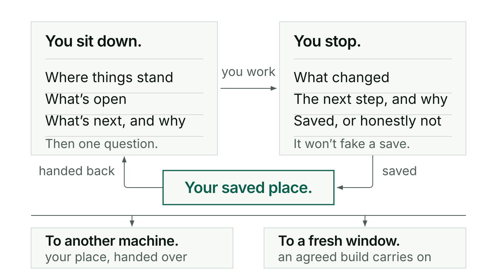

# Switch

Switch saves your place when you stop working and hands it back when you start
again, on this machine or another. The first thing you see next time is a plain
page that says where things stand, what is open, and the one thing it would do
next and why.

## When you would reach for it

At the start of a sitting, before anything else, so you are not re-explaining the
project to an AI that has never heard of it. At the end of a sitting, so what got
settled survives the window closing. When you want to carry mid-work state from
one machine to another. And when a long build has filled its context and needs to
continue somewhere fresh without starting over.

## How it goes

You open the repo you want to work in and say:

```
/kerd:switch in
```

Kerd reads the project and answers on one screen, in plain product English: a
one-row grid (project, phase, next, team), where things stand, what changed last
session, the open work one line each, and one recommendation with the reason it
comes first. Anything material about the restore, a failed sync or a contradiction
in the records, appears under ATTENTION. Then it stops on a single question,
"Start a Conductor session?", and waits.

Say yes and you are in [Conductor](conductor.md) at Shape for that work. Name
different work and it opens there instead. Say "something else" and Conductor
opens to work out what to do. Choosing work does not approve anything Conductor
then does; builds, installs and pushes each get their own approval.

Work. Then, when you stop:

```
/kerd:switch out
```

Out reads what actually changed, adds whatever the sitting settled to Conductor's
sketchbook for each piece of work, and saves the next action with its owner,
where it stops, and any question still hanging. It closes on a box: what changed
for you this session, the next step, why it comes first, and a restart line if,
and only if, the save is confirmed.

Two more actions exist for cases the first two do not cover. **To** saves the
exact mid-work position through GitHub, hands source control over, and restores
it at the other machine; it is not a full Out. **Roll** carries an authorized
build into a fresh context window without a new interview or a second go-ahead.

Underneath, In restores the project pointer, the active list (`TODO.md`'s
`## Now` by convention, child sections included), the work records that list
points at, and the decisions, constraints and known risks that still govern the
next action. It does not read every `work.md` in the repo. Out names that reading
set as exact files and sections in the start point, measures its size, and saves
the measurement beside it, so the next pickup reuses last sitting's knowledge of
where to look. Rulings stay in the pointer; the full case moves to a decisions
record. Closed rows move to a backlog archive with their verdict and date.

If you already have a Claude and Codex pairing for the project, In restores the
routing too and shows it in the TEAM cell as provider and role. See
[Agent](agent.md).

## A short exchange

This is the shape of the arrival, filled with the worked example from Switch's
own guide. Treat it as an illustration of the layout, not as a record of a real
sitting; the real screen is produced by a packaged renderer and its spacing
differs.

```
PROJECT Kerd · PHASE acceptance · NEXT Sign off the risk-rating change ·
TEAM Claude (current session) + Codex (expert review)

Where things stand
Kerd is released and working. Five steps stand before launch and none is done;
the first is signing off the risk-rating change, which shipped two weeks ago.

Open work
- Sign off the risk-rating change with real evidence, the first launch step.
- Try the 0.134.0 diagram rules on a real diagram; they have never been exercised.
- The owner: decide whether the 2026-09-13 "prove Kerd first" hold is lifted.

Recommended  Sign off the risk-rating change.
Why          It is the oldest product commitment, and every later launch step
             waits on it.
```

and the last line on the screen, always, is the question:

> 💬 **Start a Conductor session?**

Notice the third open item. A check that belongs to you stays in the list as
yours, not dressed up as agent work.

## What it will not do

In restores and recommends. It does not execute the plan, draft replies, start
reviews, repair files or go investigating the backlog. A recommendation is not
agreement, and answering its question with a choice of work approves none of
Conductor's operations. A new window grants no authority the old one lacked.

Out will not tell you a save happened when it did not. It says plainly which the
handoff reached: prepared locally, committed, or verified at the remote. A local
save is neither of the last two, and the restart line only appears once the save
is confirmed and the memory coverage is complete. It never claims the session
exited or your context was cleared, because restarting is your action.

It also will not invent memory. A missing record is reported as a gap. Where a
contributing session holds something the closeout needs, Out goes and gets it and
says who was captured and who was missing, rather than quietly writing an account
with a hole in it.

## For the curious

Two helpers do the mechanical part. `scripts/handoff.py` commits only the files
named, refuses an existing staged index or unassigned changes, fast-forwards only
when safe, acknowledges paths the project deliberately keeps out of Git without
staging them, and verifies the remote carries the exact commit before anyone says
the save reached GitHub. Its `measure` counts the reading set in bytes and
estimates tokens against the pickup target, and returns the exact `read_args` the
next In reuses. It never blocks a save.

The arrival screen is rendered by `scripts/where_we_are.py` from a summary Switch
already holds in context, so nothing extra is read and no status file is written.
Switch returns that output unchanged; corrections go into the input and are
rendered again rather than rewritten afterwards.

For a managed run, `roll_status.py --project /absolute/project` gives a read-only
view of recorded state, next action and finished workers, without private session
IDs. It is recorded progress, not a live health check.

Every command in one line each: [reference](reference.md).


