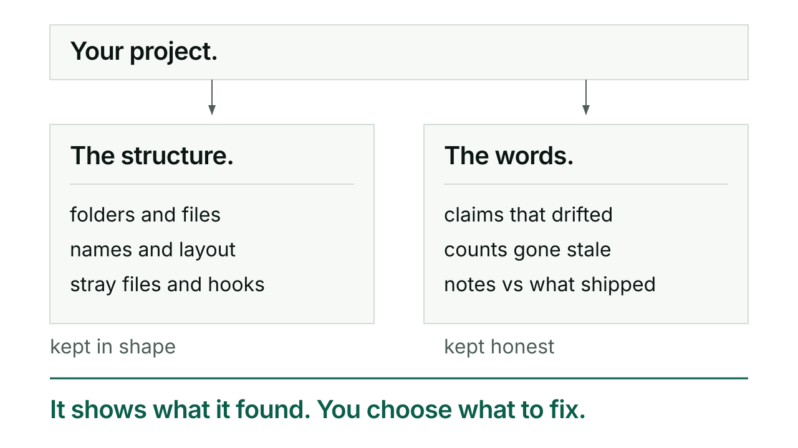

# Tend and Slainte

Tend keeps a repo's structure and plumbing in shape: directories, config files, naming, stray files, the vault, the hooks. Slainte keeps the content honest: whether a doc's claims still match the code, whether a count is stale, whether the release notes describe what actually shipped.

## When you would reach for it

Reach for tend on a brand new repo, to set everything up in one pass, or on an existing one after a Kerd update, to catch what has drifted from current convention. Reach for slainte when you want to know if the words in a doc still match the state of the project, on demand for one area, or automatically at a release: a version bump or an acceptance record landing triggers slainte's release pass.

## How tend goes

```
/kerd:tend
```

Run it at the root of a git repo. It checks nine categories: directory structure, required files, vault integration, deprecated patterns, naming consistency, stray and stale files, gitignore hygiene, skill hygiene, and hook hygiene. Each category comes back passing, failing, or a warning. Failing and warning items get a table of what is there now against what is proposed, with a reason.

After the report, you choose: fix everything, pick items one at a time, or skip and just keep the report. Tend never commits its own changes. Structural fixes stay in the working tree until you review and commit them yourself.

## How slainte goes

```
/kerd:slainte <area>
```

Valid areas are docs, code, site, deps, playbook, release, and all. Each finding gets a severity, high, medium, or low, and evidence: the specific command or comparison that found it, never a bare claim. The release pass is the one exception to report-only: it runs at a version bump or when an acceptance record lands, and it fixes what is drift under your verification gate, then lists what it deliberately left untouched and why.

## An exchange

Tend's report reads like this, a passing category shown plain and a failing one shown as a table:

```
✓ Directory structure
  kivna/  kivna/sessions/  docs/

✗ Vault integration
  ┌──────────────────┬───────────────┬─────────────────────────────┐
  │ Item             │ Current       │ Proposed                    │
  ├──────────────────┼───────────────┼─────────────────────────────┤
  │ symlinks         │ 8 found       │ remove all (vault spec      │
  │                  │               │ prohibits repo symlinks)    │
  └──────────────────┴───────────────┴─────────────────────────────┘
```

Then, outside the table:

> 💬 **Fix all of these?**

Slainte's findings carry the same discipline about evidence. A real line from its own format: `medium | CLAUDE.md § Tests | Test count says 145, actual is 148 | find . -name "*.test.*" | wc -l → 148; CLAUDE.md line 67 says 145`.

## What tend and slainte will not do

Tend never touches content, only structure: it will tell you a file is missing, never rewrite what a doc says. Slainte is the reverse, it audits what the words claim, never the directory layout. Neither of them commits on your behalf outside the release pass's own verification gate. And slainte's on-demand area audits report only by default, they do not fix anything unless you ask.

## For the curious

Tend delegates vault setup to `/kerd:kivna scaffold` rather than reimplementing it, and it is idempotent, running it twice changes nothing the second time. Slainte's release pass leaves the mechanical checks, version sync, capability-list sync, namespace prefixes, to CI, and owns only the judgment layer CI cannot: skill-count claims, cross-doc claim verification, marketplace URL, hook currency. Full command reference: [reference](reference.md).


