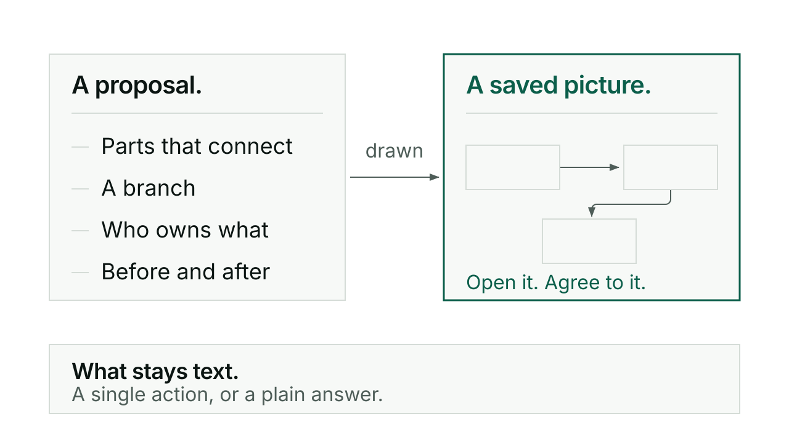

# Visuals

Visuals draws the thing you are discussing: how the parts connect, who owns what,
where the boundary of the work sits, what changes between before and after. It
produces a saved, rendered picture you can open, not a diagram made of text boxes
in a code fence.

## When you would reach for it

You rarely have to reach for it. Since v0.132.0 a picture arrives by default
whenever a proposal carries two or more connected parts, a branch, an ownership
boundary, or a before and after change. There is no offer question asking whether
you would like a diagram, and no quota. Only a single action or a factual answer
stays as text.

You would ask for one directly when you want to see something specific: the shape
of a plan before you agree to it, who is connected to the result, what is inside
the scope and what is outside, or the path a decision takes.

```
/kerd:visuals
```

Being easy to describe in words is not a reason to skip the picture. That is the
rule the skill holds itself to.

## How it goes

The picture starts from a question, not a diagram type. You are never asked to
pick between a flowchart and a sequence diagram; the work names the question the
picture has to answer, and the pattern follows from that.

It is drawn at product level first: people, capabilities, work and outcomes.
Technical architecture is a deeper view for when it helps, not the default
vocabulary. Symbols, file names, line numbers and type names sit in a subordinate
layer, never in the main relationship.

What comes back is one self-contained HTML file with the drawing inside it, saved
beside the work, plus a short line saying what it clarifies. Where the view can be
rendered and opened here, it is rendered, looked at, and checked at the size you
would view it at, phone width included when that matters. Where it cannot be, you
are told that plainly instead of being told it looks fine.

Parts that are proposed, partial or unknown are labelled as such. The view does
not quietly complete itself by guessing a requirement you never gave it.

Underneath, every Kerd view goes through one of two tools: diagram-design for
static layouts such as processes, timelines, responsibilities, scope and
comparisons, or Archify where exploration or comparing changes earns it. Those are
tendencies rather than a hard split, and a piece of work can use both. The starter
patterns bundled with the skill help choose the view; they do not draw it. The
project, product or repository is named inside the render itself, because a
filename, a browser tab and the surrounding message all sit outside the picture,
and the picture travels without them.

## A short exchange

The test every view has to pass is worth quoting, because it explains why the
pictures look the way they do. From the skill:

> remove every code reference, and the main relationship must still be
> understandable to a reader who has not opened the source.

A view that recommends or depicts a change carries more. Stripped of its code
references it must still show what you can and cannot do today, where the
responsibility sits, what changes, and any material cost or boundary that exists.
Content decides which test applies, not the title. If removing the code references
leaves the picture unreadable, it was drawn at the wrong level and gets drawn
again.

So a proposal in a Conductor session does not come back as a wall of prose with an
offer to draw something if you want it. It comes back as the summary, the saved
view, and one question about the actual decision.

## What it will not do

It will not hand you ASCII art in a code fence and call that a diagram. If neither
required tool can run on your machine, it says the view is not rendered and what
that costs you, rather than substituting something hand drawn.

It will not install a tool behind your back. The two tools are required, and
installing a missing one is still asked for; approval to draw a diagram is not
approval to install software.

It will not turn a picture into an approval gate. There is no seal, no fingerprint
and no "approve this diagram" step. Your actual agreement lives in the work record,
and when agreement is needed the question names the outcome, the boundaries and the
real tradeoffs.

It will not stop to ask you about colours, layout, type or export format. Those are
resolved from the work. A genuine product decision the drawing exposes gets asked
as that decision.

And it will not claim you saw something you did not. If preview is unavailable, it
says so and asks you to open the file, rather than recording an approval of a view
nobody looked at.

## For the curious

Visuals is a light Kerd adaptation of Cathryn Lavery's diagram-design. No CI,
hooks, seals, branding onboarding or diagram approval schema is required to use
it.

The default output is one HTML file with inline SVG and CSS and system fonts,
static first, saved with the work. Interaction is added only where it explains
something. Related views in the same piece of work share a visual style, and
known project branding is used when it is available without a separate setup
conversation.

Layout rules are the ordinary ones: simple horizontal and vertical connections
with clear endpoints, routing around unrelated nodes, no collisions between lines
and labels, no meaning carried by colour alone, and a wide diagram reflowed or
split for a narrow screen rather than shrunk until the text is unreadable.

[Conductor](conductor.md) loads this skill when it draws, which is most of why
you see views during rehearsal rather than only at the end.

Every command in one line each: [reference](reference.md).


